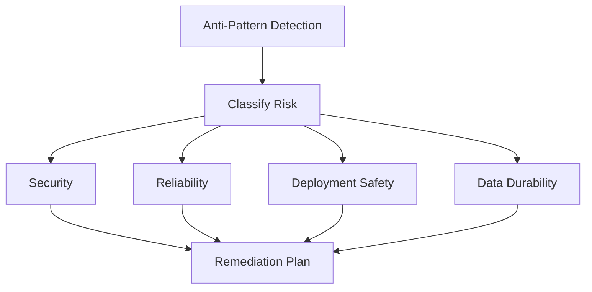

---
hide:
  - toc
---

# Common Elastic Beanstalk Anti-Patterns

This page highlights frequent production anti-patterns in AWS Elastic Beanstalk and maps each to safer alternatives.

## Why This Matters

Many incidents are not novel failures. They are repeated architecture and operations mistakes that can be prevented with explicit standards.

Recognizing anti-patterns early helps teams reduce outage frequency, data risk, and emergency maintenance load.



## Recommended Practices

Replace each anti-pattern with a durable production control.

| Anti-Pattern | Risk | Recommended Practice |
|---|---|---|
| Elastic Beanstalk-managed RDS in production | Data lifecycle coupled to environment | Use decoupled, independently managed RDS lifecycle |
| Local disk state on instances | Data loss on replacement and scaling | Store durable state in managed external services |
| Ignoring platform updates | Growing vulnerability backlog | Enable managed platform updates and maintenance windows |
| All-at-once deploys in production | Full-fleet interruption risk | Use rolling, immutable, or traffic splitting |
| Hardcoded secrets in config or code | Credential exposure | Use SSM Parameter Store or Secrets Manager |
| Single-instance production | Single point of failure | Use Auto Scaling across multiple Availability Zones |
| Missing health check endpoint design | Slow detection and false health | Implement dependency-aware health endpoint |
| No log streaming | Poor incident forensics | Stream logs to CloudWatch Logs |

Implementation priorities:

1. Fix data durability anti-patterns first.
2. Remove security anti-patterns second.
3. Replace unsafe deployment defaults third.
4. Close observability and health gaps continuously.

CLI example for safer deployment policy change:

```bash
aws elasticbeanstalk update-environment \
    --application-name $APP_NAME \
    --environment-name $ENV_NAME \
    --option-settings Namespace=aws:elasticbeanstalk:command,OptionName=DeploymentPolicy,Value=Immutable
```

CLI example for enabling enhanced health:

```bash
aws elasticbeanstalk update-environment \
    --application-name $APP_NAME \
    --environment-name $ENV_NAME \
    --option-settings Namespace=aws:elasticbeanstalk:healthreporting:system,OptionName=SystemType,Value=enhanced
```

## Common Mistakes / Anti-Patterns

The following patterns are high frequency and high impact:

- Tying critical data lifecycle to environment deletion events.
- Treating EC2 instance local storage as persistent state.
- Deferring platform updates until mandatory emergency windows.
- Choosing all-at-once deployment in production for speed.
- Committing secrets into application source or environment properties.
- Operating production on one instance and one Availability Zone.
- Exposing weak health checks that only verify process existence.
- Relying on ephemeral local logs during incident response.

Why these persist:

- Early-stage defaults become permanent.
- Teams optimize for deployment speed over operational safety.
- Ownership boundaries between platform and application teams are unclear.
- Remediation is postponed because anti-patterns appear to work until failure.

## Validation Checklist

- [ ] Production databases are decoupled from environment lifecycle.
- [ ] No critical runtime state depends on instance local disk persistence.
- [ ] Managed platform updates are enabled and reviewed.
- [ ] Production deployment policy avoids all-at-once updates.
- [ ] Sensitive data is managed through dedicated AWS secret services.
- [ ] Production uses more than one instance and multiple Availability Zones.
- [ ] Health check endpoints validate true service readiness.
- [ ] Log streaming to CloudWatch Logs is active and retained.
- [ ] Anti-pattern review is part of architecture and release governance.
- [ ] Remediation backlog is tracked with owners and due dates.

Remediation planning model:

- Immediate:
    - Secrets, health, and deployment safety controls.
- Near term:
    - Multi-AZ and stateless architecture improvements.
- Ongoing:
    - Update cadence, least privilege audits, and drift detection.

## See Also

- [Production Baseline](./production-baseline.md)
- [Security Best Practices](./security.md)
- [Deployment Best Practices](./deployment.md)
- [Reliability Best Practices](./reliability.md)

## Sources

- [Security in Elastic Beanstalk](https://docs.aws.amazon.com/elasticbeanstalk/latest/dg/security.html)
- [Using Elastic Beanstalk with Amazon VPC](https://docs.aws.amazon.com/elasticbeanstalk/latest/dg/vpc.html)
- [Enhanced Health Reporting and Monitoring](https://docs.aws.amazon.com/elasticbeanstalk/latest/dg/health-enhanced.html)
- [Deploying Existing Application Versions](https://docs.aws.amazon.com/elasticbeanstalk/latest/dg/using-features.deploy-existing-version.html)
- [General Options for All Environments](https://docs.aws.amazon.com/elasticbeanstalk/latest/dg/command-options-general.html)
