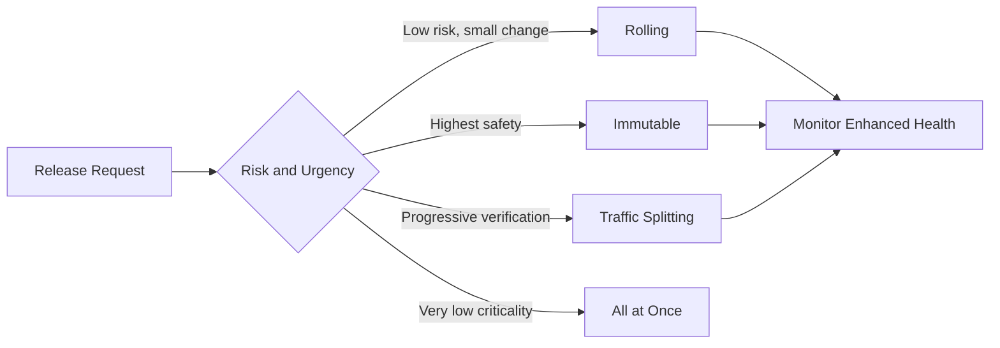

# Deployment Best Practices for Elastic Beanstalk

This page explains how to choose safe deployment strategies in AWS Elastic Beanstalk and how to structure release assets for predictable rollouts.

## Why This Matters

Deployment policy directly controls user impact during release. The right strategy minimizes risk, shortens rollback time, and protects availability while shipping changes.

Elastic Beanstalk offers multiple policies with different speed, cost, and safety trade-offs.



## Recommended Practices

Choose deployment policy based on blast radius tolerance, rollback expectations, and workload criticality.

Deployment policy comparison:

| Policy | How It Works | Best Use Case | Key Trade-Off |
|---|---|---|---|
| All at once | Replaces all instances in one operation | Development or low-criticality environments | Highest availability risk during deploy |
| Rolling | Replaces instances in batches | Moderate-risk production updates | Temporary reduced capacity |
| Rolling with additional batch | Adds temporary batch capacity before replacement | Production where capacity reduction is unacceptable | Additional temporary cost |
| Immutable | Launches new Auto Scaling group, then swaps in | High-risk or high-criticality production updates | Slower and more resource intensive |
| Traffic splitting | Shifts a percentage of traffic to new version before full cutover | Progressive validation with real traffic | Requires tight monitoring discipline |

Blue/green release recommendation:

1. Deploy new application version to a separate green environment.
2. Validate health, performance, and integrations on green.
3. Swap CNAMEs when green passes criteria.
4. Keep old blue environment available for immediate rollback window.

Configuration and artifact practices:

- Store `.ebextensions` and platform hooks in source control.
- Use platform hooks for deterministic predeploy and postdeploy actions.
- Define process model explicitly with `Procfile` where platform supports it.
- Keep environment-specific settings separate from build artifacts.

CLI example for deploying an existing version:

```bash
aws elasticbeanstalk update-environment \
    --application-name $APP_NAME \
    --environment-name $ENV_NAME \
    --version-label $VERSION_LABEL
```

CLI example for CNAME swap in blue/green:

```bash
aws elasticbeanstalk swap-environment-cnames \
    --source-environment-name $BLUE_ENV_NAME \
    --destination-environment-name $GREEN_ENV_NAME
```

## Common Mistakes / Anti-Patterns

- Using all-at-once deployments in production because they are fastest.
- Selecting immutable deployments but skipping health verification gates.
- Running blue/green swaps without warm-up and smoke checks on target environment.
- Embedding one-off commands manually instead of codifying in platform hooks.
- Relying on default process startup when a `Procfile` is needed.
- Promoting versions without observing enhanced health transitions.

Failure pattern during release windows:

- Deployment starts with incomplete readiness validation.
- Health changes are detected late due to weak monitoring coverage.
- Rollback takes longer because previous environment was already modified.

## Validation Checklist

- [ ] Deployment policy is selected intentionally per environment criticality.
- [ ] Production uses rolling, rolling with additional batch, immutable, or traffic splitting as appropriate.
- [ ] Blue/green releases use CNAME swap with verified target health.
- [ ] `.ebextensions` configuration is version-controlled and reviewed.
- [ ] Platform hooks are idempotent and tested in staging.
- [ ] `Procfile` is present when required by application process model.
- [ ] Health and rollback criteria are defined before deployment starts.
- [ ] Release pipeline verifies post-deploy health and key business paths.
- [ ] Previous version remains available for rollback window.
- [ ] Deployment runbook includes escalation and rollback ownership.

Release governance checks:

- Pre-deploy:
    - Confirm policy choice and expected impact.
    - Confirm rollback command path and previous version label.
- Post-deploy:
    - Confirm enhanced health remains stable.
    - Confirm latency and error metrics remain within threshold.

## See Also

- [Reliability Best Practices](./reliability.md)
- [Scaling Best Practices](./scaling.md)
- [Operations: Environment Management](../operations/environment-management.md)
- [Platform: Request Lifecycle](../platform/request-lifecycle.md)

## Sources

- [Deploying Existing Application Versions](https://docs.aws.amazon.com/elasticbeanstalk/latest/dg/using-features.deploy-existing-version.html)
- [Deployment Policies and Settings](https://docs.aws.amazon.com/elasticbeanstalk/latest/dg/using-features.rolling-version-deploy.html)
- [Immutable Environment Updates](https://docs.aws.amazon.com/elasticbeanstalk/latest/dg/environmentmgmt-updates-immutable.html)
- [Blue/Green Environment Deployments](https://docs.aws.amazon.com/elasticbeanstalk/latest/dg/using-features.CNAMESwap.html)
- [Platform Hooks](https://docs.aws.amazon.com/elasticbeanstalk/latest/dg/platforms-linux-extend.hooks.html)
