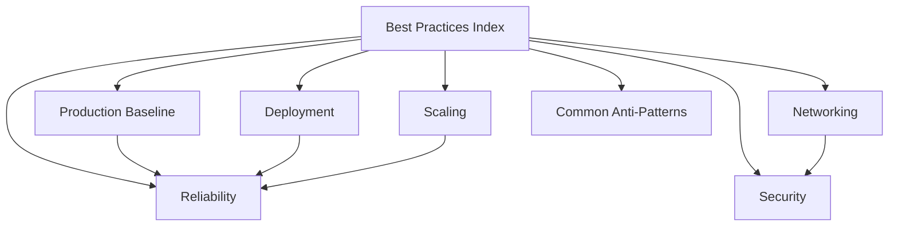

# Elastic Beanstalk Best Practices

This section consolidates production-oriented guidance for AWS Elastic Beanstalk so teams can standardize secure, reliable, and repeatable operations.

## Why This Matters

Elastic Beanstalk automates infrastructure provisioning, but production outcomes still depend on explicit choices for deployment strategy, network design, platform updates, health checks, and scaling behavior.

When teams follow consistent best practices:

- Availability risk is reduced during deploys and scaling events.
- Security posture improves through least privilege and hardened defaults.
- Operational load decreases because diagnostics and rollback paths are clearer.
- Cost decisions become intentional instead of accidental.

## Recommended Practices

Use this section as an implementation sequence, not just a reference list.

| Document | Focus Area | Primary AWS Reference |
|---|---|---|
| [Production Baseline](./production-baseline.md) | Minimum standards for production environments | command-options-general |
| [Networking](./networking.md) | VPC topology, subnet placement, and traffic boundaries | vpc |
| [Security](./security.md) | IAM, secret handling, HTTPS, and patching posture | security |
| [Deployment](./deployment.md) | Deployment policy selection and release controls | using-features.deploy-existing-version |
| [Scaling](./scaling.md) | Auto Scaling tuning and stateless patterns | using-features.managing.as |
| [Reliability](./reliability.md) | Health model, Multi-AZ resilience, graceful failure handling | health-enhanced |
| [Common Anti-Patterns](./common-anti-patterns.md) | Frequent design mistakes to avoid in production | security, vpc, health-enhanced |

Recommended adoption order:

1. Define a production baseline and enforce it for every new environment.
2. Apply VPC and security controls before onboarding external traffic.
3. Select a deployment strategy that aligns with your risk tolerance.
4. Tune scaling signals only after baseline performance is measured.
5. Validate reliability behavior using enhanced health and controlled failure tests.

Operational guardrails to include in every environment review:

- Document expected health check paths and success criteria.
- Confirm managed platform update configuration is enabled.
- Confirm HTTPS termination and certificate lifecycle ownership.
- Confirm instances behind load balancers do not require public IP addresses.
- Confirm logs stream to CloudWatch Logs for incident triage.

## Common Mistakes / Anti-Patterns

- Treating Elastic Beanstalk defaults as production-ready without explicit review.
- Mixing persistent state into instance local storage.
- Using deployment policies without matching rollback and monitoring plans.
- Enabling features inconsistently across environments.
- Postponing platform updates until emergency patch windows.

Common sequence failures:

- Teams tune Auto Scaling before establishing a stable health baseline.
- Teams add security controls after launch instead of at environment design time.
- Teams use all-at-once deployments in production due to speed pressure.

## Validation Checklist

- [ ] Every production environment maps to a documented baseline standard.
- [ ] Every environment review includes networking, security, deployment, scaling, and reliability checks.
- [ ] Every best-practices page is linked from this index and cross-linked to related pages.
- [ ] Every implementation claim in this section maps to AWS official documentation.
- [ ] Every production runbook references explicit rollback procedures.
- [ ] Every team member can identify when to choose immutable or traffic-splitting deployments.
- [ ] Every environment has health, log, and update management configured intentionally.

Review cadence recommendation:

- Weekly:
    - Review enhanced health trends and deployment outcomes.
    - Confirm no drift in critical option settings.
- Monthly:
    - Reassess instance sizing and scaling thresholds.
    - Revalidate network segmentation assumptions.
- Quarterly:
    - Rehearse blue/green or immutable failover execution.
    - Revalidate source-of-truth documentation for environment configuration.

## See Also

- [Platform Overview](../platform/index.md)
- [Operations](../operations/index.md)
- [Start Here](../start-here/overview.md)
- [Platform: Networking](../platform/networking.md)

## Sources

- [AWS Elastic Beanstalk Developer Guide](https://docs.aws.amazon.com/elasticbeanstalk/latest/dg/Welcome.html)
- [General Options for All Environments](https://docs.aws.amazon.com/elasticbeanstalk/latest/dg/command-options-general.html)
- [Using Elastic Beanstalk with Amazon VPC](https://docs.aws.amazon.com/elasticbeanstalk/latest/dg/vpc.html)
- [Security in Elastic Beanstalk](https://docs.aws.amazon.com/elasticbeanstalk/latest/dg/security.html)
- [Deploying Existing Application Versions](https://docs.aws.amazon.com/elasticbeanstalk/latest/dg/using-features.deploy-existing-version.html)
- [Auto Scaling for Elastic Beanstalk Environments](https://docs.aws.amazon.com/elasticbeanstalk/latest/dg/using-features.managing.as.html)
- [Enhanced Health Reporting and Monitoring](https://docs.aws.amazon.com/elasticbeanstalk/latest/dg/health-enhanced.html)
