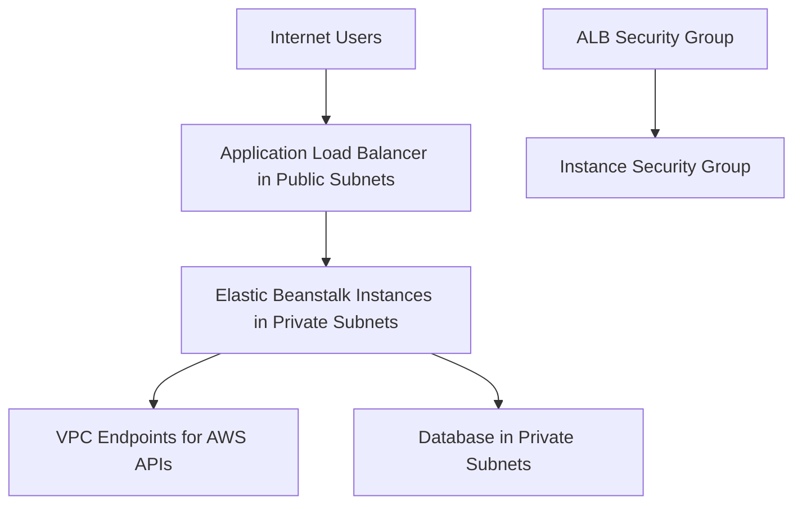

# Networking Best Practices for Elastic Beanstalk

This page describes production networking patterns for AWS Elastic Beanstalk environments running inside an Amazon VPC.

## Why This Matters

Network topology determines blast radius, exposure surface, and service reachability. In Elastic Beanstalk, subnet and security group decisions directly affect deployment safety and runtime availability.

Well-structured VPC design allows load balancers to serve internet traffic while application instances remain private and tightly controlled.



## Recommended Practices

Build networking around segmented trust boundaries.

1. Place the load balancer in public subnets to accept internet traffic.
2. Place Elastic Beanstalk EC2 instances in private subnets.
3. Disable public IP assignment for instances behind an Application Load Balancer.
4. Enforce least-privilege security group rules between tiers.
5. Use VPC endpoints for required AWS service access paths where applicable.
6. Use separate subnets across at least two Availability Zones for resilience.

Baseline topology:

| Layer | Placement | Control Objective |
|---|---|---|
| Entry | Public subnets | Inbound traffic termination at ALB |
| App tier | Private subnets | No direct internet ingress to instances |
| Data tier | Private subnets | Restrict access to application security group only |
| Service access | VPC endpoints | Reduce dependency on public egress paths |

Security group design guidance:

- Load balancer security group:
    - Allow inbound `443` from approved client CIDR ranges.
    - Allow outbound to instance security group on application listener port.
- Instance security group:
    - Allow inbound only from load balancer security group.
    - Allow outbound only to required dependencies and endpoints.

Elastic Beanstalk VPC configuration patterns:

- Single load balancer, multiple public subnets for high availability.
- Auto Scaling group instances spanning multiple private subnets.
- Explicit subnet mapping per environment to avoid implicit defaults.

CLI example for environment update with subnet controls:

```bash
aws elasticbeanstalk update-environment \
    --application-name $APP_NAME \
    --environment-name $ENV_NAME \
    --option-settings Namespace=aws:ec2:vpc,OptionName=VPCId,Value=$VPC_ID \
    Namespace=aws:ec2:vpc,OptionName=Subnets,Value=$PRIVATE_SUBNET_IDS \
    Namespace=aws:ec2:vpc,OptionName=ELBSubnets,Value=$PUBLIC_SUBNET_IDS
```

## Common Mistakes / Anti-Patterns

- Assigning public IP addresses to instances that are already behind an ALB.
- Opening instance security groups to `0.0.0.0/0` for convenience.
- Using one subnet or one Availability Zone in production.
- Co-locating internet-facing and internal workloads without clear boundaries.
- Allowing broad egress rules without dependency mapping.
- Relying on default VPC behavior without explicit subnet and routing review.

Operational anti-pattern sequence:

- Environment launches quickly in default VPC.
- Security groups are permissive to reduce initial friction.
- Public IP instances remain in production because migration is delayed.

## Validation Checklist

- [ ] Load balancer is configured in public subnets.
- [ ] Elastic Beanstalk instances are configured in private subnets.
- [ ] Public IP assignment for app instances is disabled when behind ALB.
- [ ] Ingress to instances is only from load balancer security group.
- [ ] Security group rules are least privilege and documented.
- [ ] Subnets span at least two Availability Zones.
- [ ] Routing and NAT behavior are documented for outbound dependencies.
- [ ] VPC endpoint opportunities are evaluated for required AWS services.
- [ ] Network design is consistent across staging and production.
- [ ] Connectivity tests cover ALB to instances and instances to dependencies.

Review and test cycle:

- Per release:
    - Validate security group intent against current architecture.
    - Validate health checks from ALB to instance targets.
- Monthly:
    - Audit ingress and egress rules for unused permissions.
    - Revalidate endpoint and route assumptions.

## See Also

- [Production Baseline](./production-baseline.md)
- [Security Best Practices](./security.md)
- [Reliability Best Practices](./reliability.md)
- [Platform: Networking](../platform/networking.md)

## Sources

- [Using Elastic Beanstalk with Amazon VPC](https://docs.aws.amazon.com/elasticbeanstalk/latest/dg/vpc.html)
- [General Options for All Environments](https://docs.aws.amazon.com/elasticbeanstalk/latest/dg/command-options-general.html)
- [Elastic Beanstalk and Application Load Balancers](https://docs.aws.amazon.com/elasticbeanstalk/latest/dg/environments-cfg-alb.html)
- [Security in Elastic Beanstalk](https://docs.aws.amazon.com/elasticbeanstalk/latest/dg/security.html)
