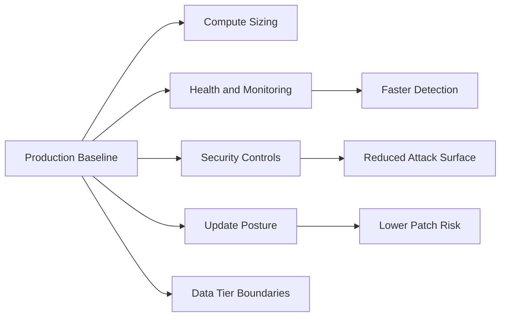

---
hide:
  - toc
---

# Production Baseline for Elastic Beanstalk

This page defines minimum production standards for AWS Elastic Beanstalk environments so teams can ship with a consistent operational floor.

## Why This Matters

Production incidents often trace back to missing baseline controls rather than complex architecture defects. A baseline ensures every environment starts from a known-good posture.

Without a baseline, teams frequently drift into inconsistent health settings, insecure metadata access, weak deployment hygiene, and incomplete observability.



## Recommended Practices

Adopt the following as non-negotiable production defaults.

1. Use at least `t3.small` for production web tiers unless measured workload data supports a different family and size.
2. Enable enhanced health reporting for richer status and cause tracking.
3. Enable managed platform updates with a predictable maintenance window.
4. Require IMDSv2 for EC2 metadata access.
5. Terminate HTTPS at the load balancer with managed certificate lifecycle.
6. Set an explicit application health check path, such as `/health`, that validates critical dependencies.
7. Stream instance and application logs to CloudWatch Logs.
8. Keep production databases decoupled from Elastic Beanstalk lifecycle.

Baseline decision table:

| Domain | Baseline Control | Outcome |
|---|---|---|
| Compute | Instance size `t3.small` or larger for production default | Better headroom during deploy spikes and warm-up |
| Health | Enhanced health enabled | Earlier warning and clearer root-cause hints |
| Updates | Managed platform updates enabled | Reduced vulnerability and platform drift |
| Metadata | IMDSv2 required | Hardens metadata credential access |
| Transport | HTTPS enforced | Protects data in transit |
| Health Path | Explicit HTTP health endpoint | Accurate target registration and replacement behavior |
| Logs | CloudWatch Logs streaming enabled | Faster incident triage and historical analysis |
| Database | Standalone RDS lifecycle | Prevents accidental data loss during environment changes |

CLI examples for baseline enforcement:

```bash
aws elasticbeanstalk update-environment \
    --application-name $APP_NAME \
    --environment-name $ENV_NAME \
    --option-settings Namespace=aws:autoscaling:launchconfiguration,OptionName=InstanceType,Value=t3.small

aws elasticbeanstalk update-environment \
    --application-name $APP_NAME \
    --environment-name $ENV_NAME \
    --option-settings Namespace=aws:elasticbeanstalk:healthreporting:system,OptionName=SystemType,Value=enhanced
```

Baseline rollout model:

- Foundation:
    - Define option settings in source control.
    - Apply the same minimum controls in all stages.
- Enforcement:
    - Block production promotion if baseline checks fail.
    - Track drift after each deployment.
- Review:
    - Revalidate baseline after platform branch upgrades.
    - Revalidate baseline after security policy changes.

## Common Mistakes / Anti-Patterns

- Running production workloads on burst-prone instance sizes without load testing.
- Leaving health checks on default paths that do not validate application readiness.
- Disabling managed updates due to short-term operational convenience.
- Allowing IMDSv1 fallback behavior in production.
- Using HTTP-only listeners after internet-facing launch.
- Relying on local instance logs only.
- Creating production data stores with Elastic Beanstalk-managed database lifecycle.

Frequent hidden failure modes:

- Health appears green while critical dependencies are failing because the health endpoint is too shallow.
- Platform patching backlog grows until emergency patches are required.
- Log loss occurs when instances terminate before logs are exported.

## Validation Checklist

- [ ] Instance type for production web tier is `t3.small` or larger by policy.
- [ ] Enhanced health reporting is enabled for the environment.
- [ ] Managed platform updates are enabled and scheduled.
- [ ] IMDSv2 is enforced for instance metadata access.
- [ ] HTTPS listener and certificate configuration are active.
- [ ] Health check path is explicit, documented, and tested.
- [ ] CloudWatch Logs streaming is enabled and retained per policy.
- [ ] Production RDS lifecycle is independent from environment termination.
- [ ] Baseline settings are source-controlled and applied consistently.
- [ ] Promotion pipeline includes baseline compliance checks.

Minimum operational review cadence:

- Per deployment:
    - Confirm no drift in critical option settings.
    - Confirm health endpoint returns dependency-aware status.
- Weekly:
    - Review enhanced health transitions and causes.
    - Review log delivery continuity.
- Monthly:
    - Review platform update status and pending actions.

## See Also

- [Networking Best Practices](./networking.md)
- [Security Best Practices](./security.md)
- [Reliability Best Practices](./reliability.md)
- [Operations: Health Monitoring](../operations/health-monitoring.md)

## Sources

- [General Options for All Environments](https://docs.aws.amazon.com/elasticbeanstalk/latest/dg/command-options-general.html)
- [Enhanced Health Reporting and Monitoring](https://docs.aws.amazon.com/elasticbeanstalk/latest/dg/health-enhanced.html)
- [Managed Platform Updates](https://docs.aws.amazon.com/elasticbeanstalk/latest/dg/environment-platform-update-managed.html)
- [Security in Elastic Beanstalk](https://docs.aws.amazon.com/elasticbeanstalk/latest/dg/security.html)
- [Streaming Elastic Beanstalk Logs to CloudWatch Logs](https://docs.aws.amazon.com/elasticbeanstalk/latest/dg/AWSHowTo.cloudwatchlogs.html)
