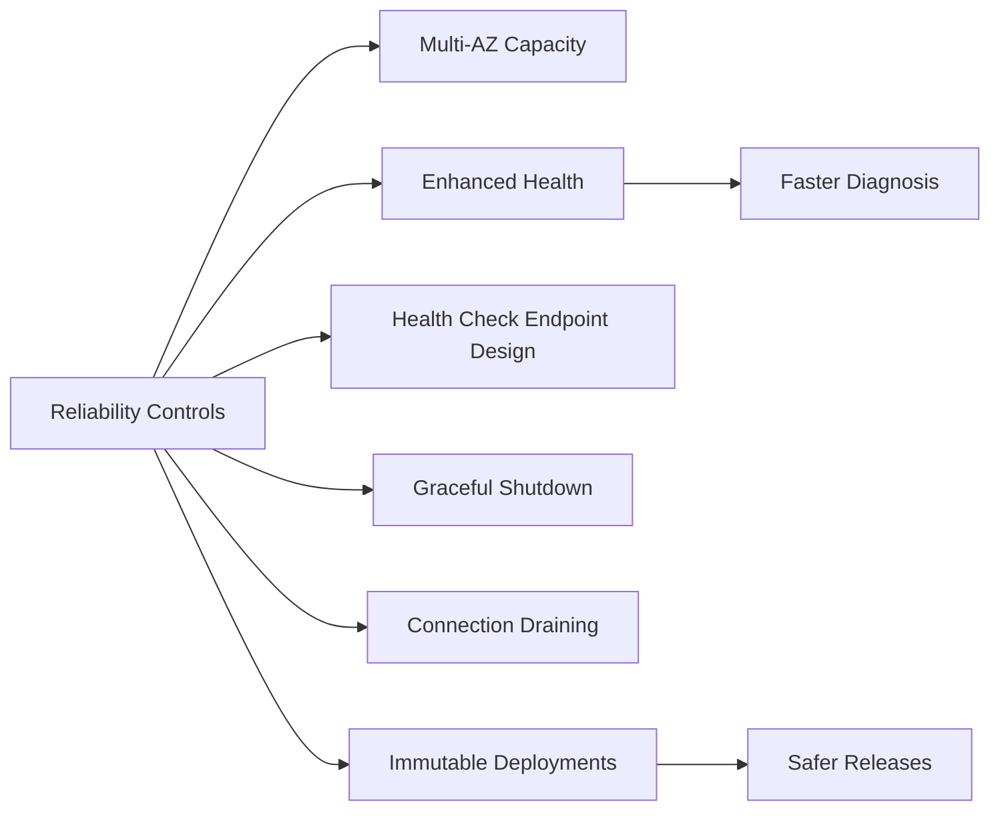

---
hide:
  - toc
---

# Reliability Best Practices for Elastic Beanstalk

This page focuses on reliability controls that keep AWS Elastic Beanstalk applications available through failures, deploys, and scaling transitions.

## Why This Matters

Reliability is not a single setting. It is a system of health signals, deployment behavior, instance lifecycle handling, and topology decisions.

Teams that design for failure early recover faster and reduce user-visible incidents.



## Recommended Practices

Adopt reliability controls as part of every environment definition.

1. Run production with capacity across multiple Availability Zones.
2. Enable enhanced health and act on status transitions quickly.
3. Design health check endpoints to represent true readiness.
4. Implement graceful shutdown for in-flight request safety.
5. Use connection draining behavior to reduce dropped requests during replacements.
6. Prefer immutable deployments for high-risk production changes.

Reliability control matrix:

| Control | Implementation Goal | Failure Mitigated |
|---|---|---|
| Multi-AZ | Spread instances across zones | Single-zone outage impact |
| Enhanced health | Detailed health causes and trends | Delayed incident detection |
| Health endpoint design | Dependency-aware readiness reporting | False-positive healthy state |
| Graceful shutdown | Drain and finish in-flight requests | Abrupt termination losses |
| Connection draining | Route traffic away before termination | User-facing request drops |
| Immutable deployment | Replace fleet with new group safely | Broad failure from bad update |

Health endpoint design guidance:

- Include critical dependency checks with bounded timeouts.
- Return non-success only when service cannot safely handle traffic.
- Keep endpoint lightweight to avoid creating self-induced instability.
- Separate liveness and readiness concerns when application framework supports it.

Graceful lifecycle handling:

- Application shutdown sequence:
    - Stop accepting new requests.
    - Complete or cancel in-flight work safely.
    - Flush telemetry and close external connections.
- Deployment and scaling sequence:
    - Drain old instances.
    - Confirm target health.
    - Continue replacement batches.

CLI example for enhanced health:

```bash
aws elasticbeanstalk update-environment \
    --application-name $APP_NAME \
    --environment-name $ENV_NAME \
    --option-settings Namespace=aws:elasticbeanstalk:healthreporting:system,OptionName=SystemType,Value=enhanced
```

## Common Mistakes / Anti-Patterns

- Running production with one Availability Zone due to initial simplicity.
- Treating health checks as process-up probes only.
- Ignoring health warning states until they become severe.
- Killing instances without connection draining and shutdown logic.
- Using risky deployment policies without rollback-safe structure.
- Assuming auto-replacement alone guarantees reliability.

Typical outage escalation pattern:

- Health endpoint reports success while downstream is failing.
- Load balancer keeps routing traffic to degraded instances.
- Deployment replaces instances abruptly without graceful drain.
- Error rates spike across the fleet.

## Validation Checklist

- [ ] Production environment spans at least two Availability Zones.
- [ ] Enhanced health is enabled and actively monitored.
- [ ] Health endpoint validates service readiness and dependencies.
- [ ] Graceful shutdown behavior is implemented and tested.
- [ ] Connection draining is validated during deploy and scale-in events.
- [ ] Immutable deployments are available for high-risk changes.
- [ ] Reliability runbooks include zone loss and failed deployment scenarios.
- [ ] Alerting includes health trend degradation, not just hard failures.
- [ ] Post-incident reviews include reliability control effectiveness checks.
- [ ] Recovery objectives are mapped to deployment and scaling behavior.

Reliability exercise cadence:

- Monthly:
    - Simulate unhealthy dependency behavior and confirm health response.
    - Validate graceful shutdown under active request load.
- Quarterly:
    - Rehearse immutable deployment rollback.
    - Reassess Multi-AZ and capacity assumptions.

## See Also

- [Deployment Best Practices](./deployment.md)
- [Scaling Best Practices](./scaling.md)
- [Operations: Health Monitoring](../operations/health-monitoring.md)
- [Platform: Request Lifecycle](../platform/request-lifecycle.md)

## Sources

- [Enhanced Health Reporting and Monitoring](https://docs.aws.amazon.com/elasticbeanstalk/latest/dg/health-enhanced.html)
- [Environment Health and Monitoring](https://docs.aws.amazon.com/elasticbeanstalk/latest/dg/health-enhanced-status.html)
- [Deploying Existing Application Versions](https://docs.aws.amazon.com/elasticbeanstalk/latest/dg/using-features.deploy-existing-version.html)
- [Immutable Environment Updates](https://docs.aws.amazon.com/elasticbeanstalk/latest/dg/environmentmgmt-updates-immutable.html)
- [Load Balancer for Your Elastic Beanstalk Environment](https://docs.aws.amazon.com/elasticbeanstalk/latest/dg/environments-cfg-alb.html)
