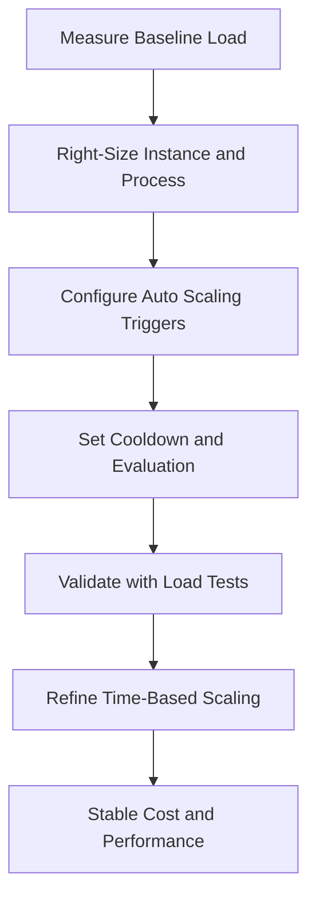

---
hide:
  - toc
---

# Scaling Best Practices for Elastic Beanstalk

This page provides practical guidance for scaling AWS Elastic Beanstalk environments with predictable performance and controlled cost.

## Why This Matters

Scaling decisions can either protect user experience or amplify instability. Poor trigger tuning causes oscillation, delayed recovery, and unnecessary spend.

Effective scaling begins with right-sizing and workload understanding before adding more instances.



## Recommended Practices

Scale systematically from baseline to automation.

1. Right-size instance class and application process settings before scaling out.
2. Tune Auto Scaling triggers using observed workload metrics.
3. Set cooldown periods to prevent rapid scale in and out oscillation.
4. Use time-based scaling for predictable traffic patterns.
5. Keep application instances stateless to support horizontal scaling.
6. Validate scaling behavior under realistic traffic in pre-production.

Auto Scaling tuning model:

| Step | Focus | Desired Outcome |
|---|---|---|
| Baseline | Single-instance or small-cluster profiling | Understand CPU, memory, and latency bottlenecks |
| Trigger design | Threshold and metric selection | Scale on meaningful saturation signals |
| Cooldown design | Stabilization windows | Avoid overreaction and flapping |
| Schedule design | Known peak periods | Pre-warm capacity before demand spikes |
| Validation | Load and soak testing | Confirm response meets service goals |

Stateless design patterns:

- Store session state in shared services rather than local disk.
- Move durable data to managed data stores.
- Ensure background tasks can resume safely on replacement instances.
- Avoid assumptions about instance identity persistence.

CLI example for Auto Scaling option updates:

```bash
aws elasticbeanstalk update-environment \
    --application-name $APP_NAME \
    --environment-name $ENV_NAME \
    --option-settings Namespace=aws:autoscaling:asg,OptionName=MinSize,Value=2 \
    Namespace=aws:autoscaling:asg,OptionName=MaxSize,Value=8
```

Time-based scaling workflow:

- Analyze historical traffic by day and hour.
- Define schedule windows for known peaks.
- Combine schedules with metric-based triggers for burst handling.
- Review results and adjust conservatively.

## Common Mistakes / Anti-Patterns

- Scaling out before fixing obvious under-sizing or inefficient process settings.
- Triggering scale actions on noisy metrics without business context.
- Using cooldown values that are too short for application warm-up time.
- Ignoring predictable peak windows that could be handled with schedules.
- Keeping sticky local state that breaks when instances terminate.
- Treating MaxSize as a substitute for performance engineering.

Common instability pattern:

- Load increases gradually.
- CPU trigger fires repeatedly.
- Cooldown is insufficient and environment thrashes.
- Latency remains high while instance count oscillates.

## Validation Checklist

- [ ] Baseline performance profile exists before Auto Scaling tuning.
- [ ] Instance and process right-sizing reviewed before raising MaxSize.
- [ ] Auto Scaling trigger thresholds are based on observed load tests.
- [ ] Cooldown periods align with application startup and warm-up behavior.
- [ ] Time-based scaling is configured for predictable traffic peaks.
- [ ] Application design is stateless across replacements and scale events.
- [ ] Scale-out and scale-in behavior validated in staging.
- [ ] Alerting covers sustained high utilization and scaling failures.
- [ ] Cost impact of scaling policy is reviewed regularly.
- [ ] Scaling settings are documented and source-controlled where possible.

Monitoring cadence:

- Per deployment:
    - Confirm scaling alarms and thresholds remain valid.
    - Confirm startup time has not regressed.
- Weekly:
    - Review scaling history and trigger effectiveness.
    - Review over-provisioning or saturation periods.

## See Also

- [Production Baseline](./production-baseline.md)
- [Reliability Best Practices](./reliability.md)
- [Operations: Scaling](../operations/scaling.md)
- [Platform: Scaling](../platform/scaling.md)

## Sources

- [Auto Scaling for Elastic Beanstalk Environments](https://docs.aws.amazon.com/elasticbeanstalk/latest/dg/using-features.managing.as.html)
- [Configuring Auto Scaling Triggers](https://docs.aws.amazon.com/elasticbeanstalk/latest/dg/environments-cfg-autoscaling-triggers.html)
- [General Options for All Environments](https://docs.aws.amazon.com/elasticbeanstalk/latest/dg/command-options-general.html)
- [Enhanced Health Reporting and Monitoring](https://docs.aws.amazon.com/elasticbeanstalk/latest/dg/health-enhanced.html)
