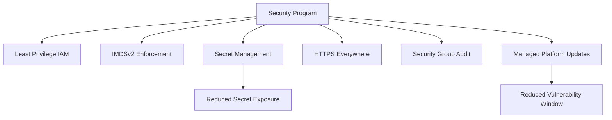

---
hide:
  - toc
---

# Security Best Practices for Elastic Beanstalk

This page outlines practical security controls for AWS Elastic Beanstalk environments aligned to AWS guidance.

## Why This Matters

Elastic Beanstalk manages infrastructure orchestration, but identity boundaries, secret handling, transport security, and patch posture remain the customer responsibility.

Security regressions in these areas can expose credentials, increase lateral movement risk, and delay incident containment.



## Recommended Practices

Prioritize controls that reduce credential exposure and unintended access.

1. Grant least-privilege IAM permissions for service roles, instance profiles, and operators.
2. Require IMDSv2 for EC2 instance metadata interactions.
3. Store sensitive values in AWS Systems Manager Parameter Store or AWS Secrets Manager.
4. Avoid storing sensitive values directly as plaintext environment properties.
5. Enforce HTTPS listeners and redirect HTTP to HTTPS.
6. Audit security groups regularly for excessive ingress and egress.
7. Enable managed platform updates to keep AMIs and platform components current.

Control mapping:

| Security Domain | Recommended Control | Expected Benefit |
|---|---|---|
| IAM | Scoped roles and policies | Reduced privilege escalation path |
| Metadata | IMDSv2-only access | Reduced risk from SSRF-style metadata abuse |
| Secrets | SSM Parameter Store or Secrets Manager | Centralized rotation and access policy |
| Transport | HTTPS end-to-end where applicable | Confidentiality and integrity in transit |
| Network | Security group least privilege | Reduced accidental exposure |
| Patch posture | Managed platform updates | Faster remediation cadence |

CLI example for metadata hardening:

```bash
aws elasticbeanstalk update-environment \
    --application-name $APP_NAME \
    --environment-name $ENV_NAME \
    --option-settings Namespace=aws:autoscaling:launchconfiguration,OptionName=DisableIMDSv1,Value=true
```

Security operations cadence:

- Daily:
    - Review high-severity enhanced health and deployment events.
- Weekly:
    - Review IAM policy changes for service roles and instance profiles.
    - Review security group rule drift.
- Monthly:
    - Confirm managed updates executed as expected.
    - Revalidate secret retrieval and rotation workflows.

## Common Mistakes / Anti-Patterns

- Granting wildcard IAM actions when narrowly scoped actions are possible.
- Keeping IMDSv1 enabled for compatibility without a sunset plan.
- Injecting database passwords directly into environment variables.
- Leaving HTTP listeners active without redirect and TLS enforcement.
- Treating security group audits as one-time setup tasks.
- Delaying platform updates for long periods.

Frequent breach-enabling patterns:

- Shared roles across unrelated environments.
- Broad outbound permissions that bypass intended segmentation controls.
- Secrets copied into deployment artifacts or startup scripts without policy controls.

## Validation Checklist

- [ ] Service roles and instance profiles are least privilege and documented.
- [ ] IMDSv2 requirement is enforced for all production instances.
- [ ] Sensitive secrets are sourced from SSM Parameter Store or Secrets Manager.
- [ ] No plaintext sensitive secrets are stored directly in environment properties.
- [ ] HTTPS listeners are active and HTTP redirection behavior is verified.
- [ ] Security groups restrict ingress and egress to required flows only.
- [ ] Managed platform updates are enabled with maintenance windows.
- [ ] IAM, network, and update controls are reviewed on a recurring schedule.
- [ ] Security findings have ownership and remediation targets.
- [ ] Environment teardown and rebuild retain security baseline controls.

Recommended incident readiness drills:

- Credential exposure drill:
    - Rotate affected secret.
    - Confirm application retrieves updated value without redeploy risk.
- Policy hardening drill:
    - Remove unused permissions.
    - Confirm environment operations remain healthy.

## See Also

- [Production Baseline](./production-baseline.md)
- [Networking Best Practices](./networking.md)
- [Reliability Best Practices](./reliability.md)
- [Operations: Updates and Patching](../operations/updates-and-patching.md)

## Sources

- [Security in Elastic Beanstalk](https://docs.aws.amazon.com/elasticbeanstalk/latest/dg/security.html)
- [General Options for All Environments](https://docs.aws.amazon.com/elasticbeanstalk/latest/dg/command-options-general.html)
- [Managing Environment Variables and Other Software Settings](https://docs.aws.amazon.com/elasticbeanstalk/latest/dg/environments-cfg-softwaresettings.html)
- [Managed Platform Updates](https://docs.aws.amazon.com/elasticbeanstalk/latest/dg/environment-platform-update-managed.html)
