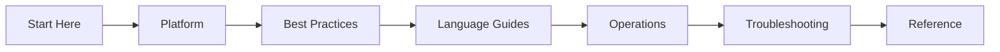

# AWS Elastic Beanstalk Practical Guide

Comprehensive, practical documentation for building, deploying, operating, and troubleshooting web applications on AWS Elastic Beanstalk.

This site is organized as a learning and operations guide so you can move from fundamentals to production troubleshooting with clear, repeatable workflows.

-   :material-rocket-launch:{ .lg .middle } **New to Elastic Beanstalk?**

    ---

    Start with platform fundamentals and deploy your first app in under 30 minutes.

    [:octicons-arrow-right-24: Start Here](start-here/overview.md)

-   :material-server:{ .lg .middle } **Running Production Apps?**

    ---

    Apply battle-tested patterns for security, scaling, deployment, and reliability.

    [:octicons-arrow-right-24: Best Practices](best-practices/index.md)

-   :material-fire:{ .lg .middle } **Investigating an Incident?**

    ---

    Jump straight to hypothesis-driven playbooks with real log patterns and diagnostic commands.

    [:octicons-arrow-right-24: Troubleshooting](troubleshooting/index.md)

## Navigate the Guide

| Section | Purpose |
|---|---|
| [Start Here](start-here/overview.md) | Orientation, learning paths, and repository map. |
| [Platform](platform/index.md) | Understand core Elastic Beanstalk architecture, lifecycle, scaling, and networking. |
| [Best Practices](best-practices/index.md) | Apply production patterns for security, networking, deployment, scaling, and reliability. |
| [Language Guides](language-guides/index.md) | Follow end-to-end implementation tracks for Python, Node.js, Java, and .NET. |
| [Operations](operations/index.md) | Run production workloads with scaling, security, health, and cost practices. |
| [Troubleshooting](troubleshooting/index.md) | Diagnose deployment, performance, and networking issues quickly. |
| [Reference](reference/index.md) | Use quick lookups for EB CLI, limits, and environment properties. |

For orientation and study order, start with [Start Here](start-here/overview.md).

## Learning Flow

## Scope and Disclaimer

This is an independent community project. Not affiliated with or endorsed by Amazon Web Services.

Primary product reference: [AWS Elastic Beanstalk Developer Guide](https://docs.aws.amazon.com/elasticbeanstalk/latest/dg/Welcome.html)

## See Also

- [Overview](start-here/overview.md)
- [Learning Paths](start-here/learning-paths.md)
- [Repository Map](start-here/repository-map.md)

## Sources

- [AWS Elastic Beanstalk Developer Guide](https://docs.aws.amazon.com/elasticbeanstalk/latest/dg/Welcome.html)
