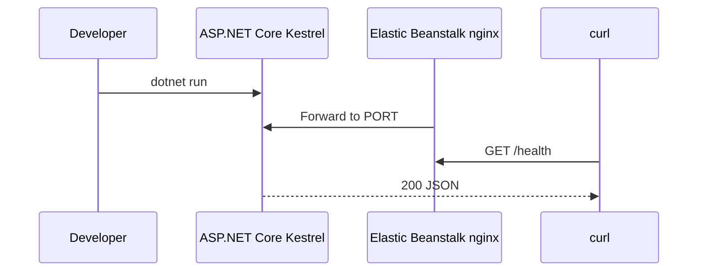

# Run an ASP.NET Core App Locally for Elastic Beanstalk

This tutorial prepares an ASP.NET Core Web API for AWS Elastic Beanstalk by matching the Linux runtime model locally.
On Linux, Elastic Beanstalk injects a `PORT` environment variable and proxies traffic from nginx to Kestrel.

## Prerequisites

- .NET 8 SDK installed.
- A clean working folder.
- `curl` available for endpoint checks.

## What You'll Build

You will build a minimal ASP.NET Core app that:

- Uses controllers for health and demo endpoints.
- Binds to `PORT` when Elastic Beanstalk sets it.
- Falls back to port `5000` locally.
- Starts with `dotnet GuideApi.dll` from a `Procfile`.

Project target structure:

```text
.
├── Controllers/
│   ├── DemoController.cs
│   └── HealthController.cs
├── GuideApi.csproj
├── Program.cs
├── Procfile
└── appsettings.json
```

## Steps

1. Create the project.

```bash
dotnet new webapi --framework net8.0 --use-controllers --output dotnet-aspnetcore
```

2. Update `Program.cs` to honor `PORT`.

```csharp
var builder = WebApplication.CreateBuilder(args);

builder.Services.AddControllers();

var portValue = Environment.GetEnvironmentVariable("PORT");
if (!string.IsNullOrWhiteSpace(portValue) && int.TryParse(portValue, out var port))
{
    builder.WebHost.UseUrls($"http://0.0.0.0:{port}");
}

var app = builder.Build();

app.MapGet("/", () => Results.Ok(new { status = "running" }));
app.MapControllers();
app.Run();
```

3. Add a health endpoint and information endpoint.

```csharp
[ApiController]
[Route("")]
public class HealthController : ControllerBase
{
    [HttpGet("health")]
    public IActionResult Health() => Ok(new { status = "healthy" });

    [HttpGet("info")]
    public IActionResult Info() => Ok(new
    {
        environment = Environment.GetEnvironmentVariable("ASPNETCORE_ENVIRONMENT") ?? "Development",
        port = Environment.GetEnvironmentVariable("PORT") ?? "5000"
    });
}
```

4. Add a demo endpoint for safe environment properties.

```csharp
[ApiController]
[Route("demo")]
public class DemoController : ControllerBase
{
    [HttpGet("env")]
    public IActionResult Env() => Ok(new
    {
        ENV_NAME = Environment.GetEnvironmentVariable("ENV_NAME") ?? "local",
        APP_VERSION = Environment.GetEnvironmentVariable("APP_VERSION") ?? "not-set"
    });
}
```

5. Create the Linux startup command.

```text
web: dotnet GuideApi.dll
```

6. Run the app locally.

```bash
dotnet run --project GuideApi.csproj
```

7. Test both the default port and the Elastic Beanstalk-style port.

```bash
curl --silent "http://127.0.0.1:5000/health"
PORT="8080" dotnet run --project GuideApi.csproj
curl --silent "http://127.0.0.1:8080/info"
```



## Verification

Run these checks before packaging for Elastic Beanstalk:

```bash
dotnet build GuideApi.csproj
dotnet run --project GuideApi.csproj
curl --silent "http://127.0.0.1:5000/health"
```

Expected results:

- The project builds cleanly.
- Kestrel listens locally.
- `/health`, `/info`, and `/demo/env` return JSON.
- The same startup path can bind to an Elastic Beanstalk-provided `PORT`.

## See Also

- [First Deploy](./02-first-deploy.md)
- [Configuration](./03-configuration.md)
- [.NET Runtime Reference](./dotnet-runtime.md)

## Sources

- [Deploying a .NET application with Elastic Beanstalk](https://docs.aws.amazon.com/elasticbeanstalk/latest/dg/dotnet-core-tutorial.html)
