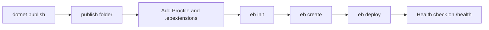

# First Elastic Beanstalk Deploy for .NET

This tutorial walks through the first deployment of an ASP.NET Core application to AWS Elastic Beanstalk with the EB CLI.
The main path uses the Linux platform branch, publishes the app, and deploys a zip bundle built from the publish output.

## Prerequisites

- Completed [01-local-run.md](./01-local-run.md).
- AWS CLI and EB CLI installed.
- A target region exported as `$REGION`.
- ASP.NET Core application with `GuideApi.csproj`, `Program.cs`, `Procfile`, and `/health` endpoint.

## What You'll Build

You will create:

- An Elastic Beanstalk application.
- A Linux web server environment.
- A deployable application version from `dotnet publish` output.
- A repeatable status and health verification path.

## Steps

1. Export working variables.

```bash
export APP_NAME="eb-dotnet-guide"
export ENV_NAME="eb-dotnet-guide-dev"
export REGION="ap-northeast-2"
```

2. Initialize Elastic Beanstalk metadata.

```bash
eb init --platform ".NET 8 running on 64bit Amazon Linux 2023" --region "$REGION"
```

3. Publish the application.

```bash
dotnet publish GuideApi.csproj --configuration Release --output publish
```

4. Copy Elastic Beanstalk deployment files into the publish folder.

```bash
cp Procfile publish/Procfile
cp -R .ebextensions publish/.ebextensions
```

5. Create the source bundle from the publish output.

```bash
(cd publish && zip --recurse-paths "../$APP_NAME.zip" .)
```

6. Create the environment.

```bash
eb create "$ENV_NAME" --single
```

7. Deploy the current version.

```bash
eb deploy "$ENV_NAME" --staged
```

8. Check status and health.

```bash
eb status "$ENV_NAME"
eb health "$ENV_NAME"
eb open "$ENV_NAME"
```



## Verification

Use these commands after the first deploy:

```bash
eb status "$ENV_NAME"
eb events "$ENV_NAME" --follow
aws elasticbeanstalk describe-environments --application-name "$APP_NAME" --region "$REGION"
```

Expected checks:

- Environment status becomes `Ready`.
- Enhanced health becomes `Green` after the app answers `/health`.
- Events show a successful application version deployment.
- The environment URL returns the ASP.NET Core root payload.

## See Also

- [Configuration](./03-configuration.md)
- [Logging and Monitoring](./04-logging-monitoring.md)
- [.NET Runtime Reference](./dotnet-runtime.md)

## Sources

- [Getting started with Elastic Beanstalk using the EB CLI](https://docs.aws.amazon.com/elasticbeanstalk/latest/dg/eb-cli3-getting-started.html)
- [Deploying a .NET application with Elastic Beanstalk](https://docs.aws.amazon.com/elasticbeanstalk/latest/dg/dotnet-core-tutorial.html)
