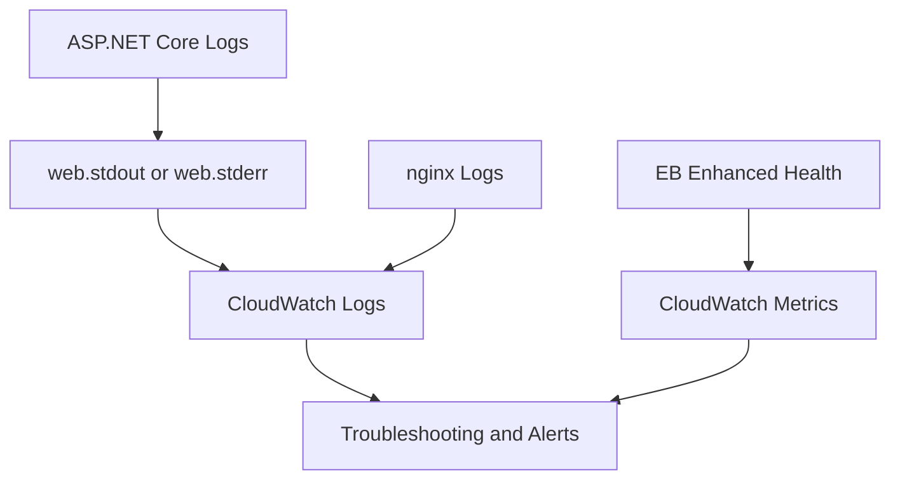

# Logging and Monitoring for .NET Environments

This tutorial maps the main observability controls for ASP.NET Core on Elastic Beanstalk.
It covers instance log retrieval, CloudWatch Logs streaming, health reporting, and structured application logging.

## Prerequisites

- Running Elastic Beanstalk .NET environment.
- IAM permissions for CloudWatch Logs, CloudWatch metrics, and Elastic Beanstalk APIs.
- Access to application logs and deployment logs.

## What You'll Build

You will build an observation baseline with:

- Instance log retrieval through the EB CLI.
- CloudWatch Logs streaming enabled from `.ebextensions`.
- Structured ASP.NET Core logs suitable for Serilog-style JSON output.
- Environment health and CloudWatch metrics review.

## Steps

1. Retrieve Elastic Beanstalk logs.

```bash
eb logs --zip
eb logs --all
```

2. Review the key Linux log files.

- `/var/log/eb-engine.log`
- `/var/log/nginx/access.log`
- `/var/log/nginx/error.log`
- `/var/log/web.stdout.log`
- `/var/log/web.stderr.log`

3. Keep CloudWatch Logs streaming enabled.

```yaml
option_settings:
    aws:elasticbeanstalk:cloudwatch:logs:
        StreamLogs: true
        DeleteOnTerminate: false
        RetentionInDays: 14
```

4. Add structured logging in ASP.NET Core.

```csharp
builder.Host.UseSerilog((context, loggerConfiguration) =>
    loggerConfiguration
        .ReadFrom.Configuration(context.Configuration)
        .Enrich.FromLogContext()
        .WriteTo.Console());
```

5. Query log groups and metrics.

```bash
aws logs describe-log-groups --log-group-name-prefix "/aws/elasticbeanstalk/$ENV_NAME" --region "$REGION"
aws cloudwatch list-metrics --namespace "AWS/ElasticBeanstalk" --region "$REGION"
eb health "$ENV_NAME"
```



## Verification

Use these checks after each deployment:

```bash
eb events "$ENV_NAME" --follow
eb logs --all
aws logs describe-log-streams --log-group-name "/aws/elasticbeanstalk/$ENV_NAME/var/log/web.stdout.log" --region "$REGION"
```

Expected outcomes:

- Deployment logs show the publish bundle starting correctly.
- Application logs reach CloudWatch Logs.
- Health transitions match request behavior.
- Structured logs can be parsed consistently by downstream tooling.

## See Also

- [Configuration](./03-configuration.md)
- [Infrastructure as Code](./05-infrastructure-as-code.md)
- [Troubleshooting Hub](../../troubleshooting/index.md)

## Sources

- [Viewing Elastic Beanstalk environment logs](https://docs.aws.amazon.com/elasticbeanstalk/latest/dg/using-features.logging.html)
- [Streaming Elastic Beanstalk logs to CloudWatch Logs](https://docs.aws.amazon.com/elasticbeanstalk/latest/dg/AWSHowTo.cloudwatchlogs.html)
