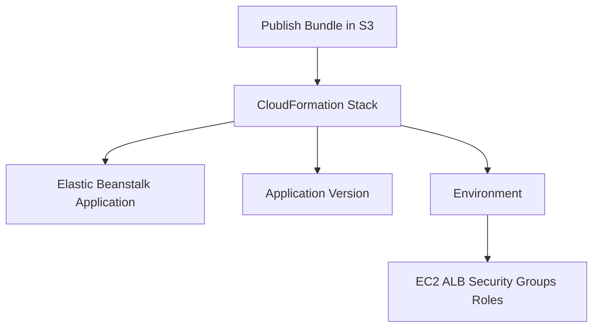

# Define Elastic Beanstalk .NET Environments with CloudFormation

This tutorial shows how to model a .NET Elastic Beanstalk deployment with AWS CloudFormation.
It focuses on the Elastic Beanstalk application, version, environment, and option settings required for ASP.NET Core.

## Prerequisites

- Working .NET publish bundle.
- An S3 bucket for application versions.
- IAM permissions for CloudFormation, S3, and Elastic Beanstalk.

## What You'll Build

You will define:

- `AWS::ElasticBeanstalk::Application`.
- `AWS::ElasticBeanstalk::ApplicationVersion`.
- `AWS::ElasticBeanstalk::Environment`.
- Option settings for instance profile, service role, and `/health` checks.

## Steps

1. Upload the application bundle to S3.

```bash
aws s3 cp "publish/$APP_NAME.zip" "s3://$BUCKET_NAME/$APP_NAME/$APP_NAME.zip" --region "$REGION"
```

2. Define the CloudFormation template.

```yaml
AWSTemplateFormatVersion: "2010-09-09"
Parameters:
    ApplicationName:
        Type: String
    EnvironmentName:
        Type: String
    SolutionStackName:
        Type: String
        Default: ".NET 8 running on 64bit Amazon Linux 2023"
    VersionLabel:
        Type: String
    BucketName:
        Type: String
Resources:
    EbApplication:
        Type: AWS::ElasticBeanstalk::Application
        Properties:
            ApplicationName: !Ref ApplicationName
    EbApplicationVersion:
        Type: AWS::ElasticBeanstalk::ApplicationVersion
        Properties:
            ApplicationName: !Ref ApplicationName
            SourceBundle:
                S3Bucket: !Ref BucketName
                S3Key: !Sub "${ApplicationName}/${VersionLabel}.zip"
    EbEnvironment:
        Type: AWS::ElasticBeanstalk::Environment
        Properties:
            ApplicationName: !Ref ApplicationName
            EnvironmentName: !Ref EnvironmentName
            SolutionStackName: !Ref SolutionStackName
            VersionLabel: !Ref VersionLabel
            OptionSettings:
                - Namespace: aws:elasticbeanstalk:environment:process:default
                  OptionName: HealthCheckPath
                  Value: /health
                - Namespace: aws:autoscaling:launchconfiguration
                  OptionName: IamInstanceProfile
                  Value: aws-elasticbeanstalk-ec2-role
                - Namespace: aws:elasticbeanstalk:environment
                  OptionName: ServiceRole
                  Value: aws-elasticbeanstalk-service-role
```

3. Deploy the stack.

```bash
aws cloudformation deploy --template-file infrastructure/elastic-beanstalk.yaml --stack-name "$APP_NAME-stack" --capabilities CAPABILITY_IAM --parameter-overrides ApplicationName="$APP_NAME" EnvironmentName="$ENV_NAME" VersionLabel="$APP_NAME" BucketName="$BUCKET_NAME" --region "$REGION"
```

4. Review the created environment and events.

```bash
aws elasticbeanstalk describe-environments --application-name "$APP_NAME" --region "$REGION"
aws cloudformation describe-stacks --stack-name "$APP_NAME-stack" --region "$REGION"
```



## Verification

Use these checks after every stack deployment:

```bash
aws cloudformation describe-stack-events --stack-name "$APP_NAME-stack" --region "$REGION"
aws elasticbeanstalk describe-configuration-settings --application-name "$APP_NAME" --environment-name "$ENV_NAME" --region "$REGION"
```

Expected outcomes:

- CloudFormation completes without rollback.
- The environment uses the expected .NET platform branch.
- `/health` is configured as the process health check path.
- The application version points to the S3 source bundle you uploaded.

## See Also

- [First Deploy](./02-first-deploy.md)
- [CI/CD](./06-ci-cd.md)
- [IAM Instance Profile Recipe](./recipes/iam-instance-profile.md)

## Sources

- [AWS CloudFormation support for Elastic Beanstalk](https://docs.aws.amazon.com/elasticbeanstalk/latest/dg/AWSHowTo.cloudformation.html)
- [AWS::ElasticBeanstalk::Environment resource reference](https://docs.aws.amazon.com/AWSCloudFormation/latest/UserGuide/aws-resource-beanstalk-environment.html)
