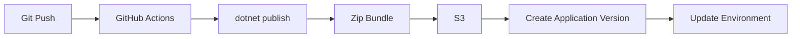

# Build and Deploy .NET to Elastic Beanstalk with GitHub Actions

This tutorial creates a GitHub Actions workflow for ASP.NET Core on Elastic Beanstalk.
The pipeline restores dependencies, publishes the app, packages the deployable output, creates an application version, and updates the environment.

## Prerequisites

- GitHub repository hosting the application.
- Elastic Beanstalk application and environment already created.
- GitHub secrets for AWS authentication or OpenID Connect role assumption.
- S3 bucket for application versions.

## What You'll Build

You will create a pipeline that:

- Runs on every push to `main`.
- Builds the .NET project.
- Publishes to a `publish/` folder.
- Uploads the bundle to S3.
- Creates a new Elastic Beanstalk application version.
- Points the environment to the new version.

## Steps

1. Store pipeline inputs as GitHub repository secrets or variables.

- `AWS_REGION`
- `EB_APPLICATION_NAME`
- `EB_ENVIRONMENT_NAME`
- `EB_BUCKET_NAME`

2. Create `.github/workflows/dotnet-eb.yml`.

```yaml
name: deploy-dotnet-eb

on:
    push:
        branches:
            - main

jobs:
    deploy:
        runs-on: ubuntu-latest
        permissions:
            id-token: write
            contents: read
        steps:
            - name: Checkout
              uses: actions/checkout@v4

            - name: Configure AWS credentials
              uses: aws-actions/configure-aws-credentials@v4
              with:
                  role-to-assume: ${{ secrets.AWS_ROLE_ARN }}
                  aws-region: ${{ vars.AWS_REGION }}

            - name: Setup .NET
              uses: actions/setup-dotnet@v4
              with:
                  dotnet-version: 8.0.x

            - name: Publish
              run: dotnet publish apps/dotnet-aspnetcore/GuideApi.csproj --configuration Release --output publish

            - name: Add Elastic Beanstalk files
              run: |
                  cp apps/dotnet-aspnetcore/Procfile publish/Procfile
                  cp -R apps/dotnet-aspnetcore/.ebextensions publish/.ebextensions

            - name: Create zip bundle
              run: |
                  cd publish
                  zip --recurse-paths "../${{ github.sha }}.zip" .

            - name: Upload bundle
              run: aws s3 cp "${{ github.sha }}.zip" "s3://${{ vars.EB_BUCKET_NAME }}/${{ vars.EB_APPLICATION_NAME }}/${{ github.sha }}.zip" --region "${{ vars.AWS_REGION }}"

            - name: Create application version
              run: aws elasticbeanstalk create-application-version --application-name "${{ vars.EB_APPLICATION_NAME }}" --version-label "${{ github.sha }}" --source-bundle S3Bucket="${{ vars.EB_BUCKET_NAME }}",S3Key="${{ vars.EB_APPLICATION_NAME }}/${{ github.sha }}.zip" --process --region "${{ vars.AWS_REGION }}"

            - name: Update environment
              run: aws elasticbeanstalk update-environment --environment-name "${{ vars.EB_ENVIRONMENT_NAME }}" --version-label "${{ github.sha }}" --region "${{ vars.AWS_REGION }}"
```

3. Observe the environment update after a push.

```bash
aws elasticbeanstalk describe-events --environment-name "$ENV_NAME" --region "$REGION"
```



## Verification

Validate the pipeline and environment after each run:

```bash
aws elasticbeanstalk describe-environments --environment-names "$ENV_NAME" --region "$REGION"
aws elasticbeanstalk describe-events --environment-name "$ENV_NAME" --max-records 20 --region "$REGION"
```

Expected outcomes:

- Workflow publishes the app successfully.
- A new application version appears in Elastic Beanstalk.
- The environment updates to the Git commit SHA version label.
- Health returns to `Green` after deployment.

## See Also

- [Infrastructure as Code](./05-infrastructure-as-code.md)
- [Logging and Monitoring](./04-logging-monitoring.md)
- [Custom Domain and SSL](./07-custom-domain-ssl.md)

## Sources

- [Application versions in Elastic Beanstalk](https://docs.aws.amazon.com/elasticbeanstalk/latest/dg/applications-versions.html)
- [AWS Elastic Beanstalk API CreateApplicationVersion](https://docs.aws.amazon.com/elasticbeanstalk/latest/api/API_CreateApplicationVersion.html)
