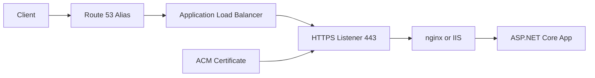

# Configure a Custom Domain and TLS for .NET on Elastic Beanstalk

This tutorial connects a Route 53 DNS name and an ACM certificate to an Elastic Beanstalk web environment.
For load-balanced environments, the HTTPS listener terminates TLS at the load balancer in front of the .NET application.

## Prerequisites

- Running load-balanced Elastic Beanstalk environment.
- Hosted zone in Route 53.
- ACM certificate requested in the same region as the load balancer.
- Permissions for Route 53, ACM, Elastic Beanstalk, and Elastic Load Balancing.

## What You'll Build

You will configure:

- An ACM certificate for your hostname.
- An HTTPS listener on the environment load balancer.
- A Route 53 alias record pointing to the Elastic Beanstalk load balancer.
- Optional HTTP-to-HTTPS redirect behavior.

## Steps

1. Request or import the certificate.

```bash
aws acm request-certificate --domain-name "api.example.com" --validation-method DNS --region "$REGION"
```

2. Find the load balancer managed by the environment.

```bash
aws elasticbeanstalk describe-environment-resources --environment-name "$ENV_NAME" --region "$REGION"
```

3. Add HTTPS listener settings through `.ebextensions` or the console.

```yaml
option_settings:
    aws:elbv2:listener:443:
        ListenerEnabled: true
        Protocol: HTTPS
        SSLCertificateArns: arn:aws:acm:ap-northeast-2:<account-id>:certificate/<certificate-id>
```

4. Create the Route 53 alias record that targets the environment load balancer.

```bash
aws route53 change-resource-record-sets --hosted-zone-id "<hosted-zone-id>" --change-batch file://route53-alias.json
```

5. Redirect HTTP to HTTPS if your application requires it.

```csharp
app.UseHttpsRedirection();
```



## Verification

Use these checks after DNS and listener updates:

```bash
aws acm describe-certificate --certificate-arn "arn:aws:acm:ap-northeast-2:<account-id>:certificate/<certificate-id>" --region "$REGION"
aws route53 list-resource-record-sets --hosted-zone-id "<hosted-zone-id>"
curl --verbose "https://api.example.com/health"
```

Expected outcomes:

- ACM certificate status is `ISSUED`.
- Route 53 alias resolves to the environment load balancer.
- HTTPS requests succeed.
- `/health` still returns `200` through the custom domain.

## See Also

- [CI/CD](./06-ci-cd.md)
- [Configuration](./03-configuration.md)
- [Operations: Environment Management](../../operations/environment-management.md)

## Sources

- [Configuring HTTPS listeners for your Elastic Beanstalk environment](https://docs.aws.amazon.com/elasticbeanstalk/latest/dg/configuring-https-elb.html)
- [Routing traffic to an Elastic Load Balancer](https://docs.aws.amazon.com/Route53/latest/DeveloperGuide/routing-to-elb-load-balancer.html)
