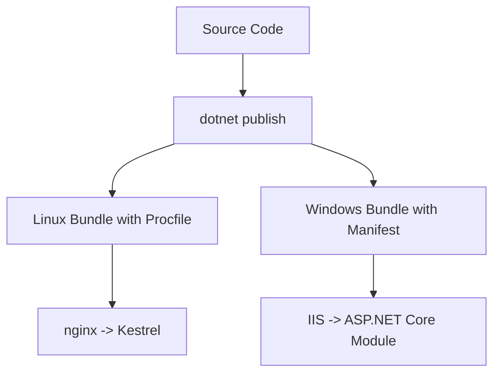

# .NET Runtime on Elastic Beanstalk

This reference explains how Elastic Beanstalk runs ASP.NET Core applications on Linux and Windows.
It highlights platform branches, startup files, port binding, deployment packaging, and runtime-specific extension points.

## Prerequisites

- Familiarity with the core .NET guide.
- Access to the application source and publish output.
- Ability to inspect environment configuration and logs.

## What You'll Build

You will establish a runtime baseline that includes:

- Linux platform behavior for .NET 8 on Amazon Linux 2023.
- Windows platform behavior under IIS.
- Startup artifacts required by each runtime.
- Deployment packaging expectations for published output.

## Steps

1. List available platform versions.

```bash
aws elasticbeanstalk list-platform-versions --region "$REGION"
```

2. Use the Linux platform branch for .NET 8 when you want Kestrel behind nginx.

```bash
eb init --platform ".NET 8 running on 64bit Amazon Linux 2023" --region "$REGION"
```

Linux runtime facts:

- Elastic Beanstalk provides `PORT`.
- Kestrel listens on that port.
- `Procfile` can override the default start command.
- Deployments normally use `dotnet publish --configuration Release --output publish`.

3. Use the Windows platform when you need IIS-hosted ASP.NET Core.

Windows runtime facts:

- IIS fronts the application.
- `aws-windows-deployment-manifest.json` tells Elastic Beanstalk what to deploy.
- Application startup is managed by the Windows platform integration instead of a Linux `Procfile`.

4. Keep the required deployment artifacts in the bundle.

```text
publish/
├── GuideApi.dll
├── GuideApi.runtimeconfig.json
├── appsettings.json
├── Procfile
└── .ebextensions/
```

5. Inspect the runtime after deployment.

```bash
eb logs --all
aws elasticbeanstalk describe-configuration-settings --application-name "$APP_NAME" --environment-name "$ENV_NAME" --region "$REGION"
```



## Verification

Validate runtime assumptions with these checks:

```bash
eb status "$ENV_NAME"
eb logs --all
curl --silent "http://$CNAME/health"
```

Expected outcomes:

- Linux environments expose the application through nginx and Kestrel.
- Windows environments rely on IIS deployment metadata.
- Publish output contains runtime configuration files and the main DLL.
- Health checks succeed on `/health`.

## See Also

- [Local Run](./01-local-run.md)
- [First Deploy](./02-first-deploy.md)
- [Custom Platform Hooks Recipe](./recipes/custom-platform-hooks.md)

## Sources

- [Deploying a .NET application with Elastic Beanstalk](https://docs.aws.amazon.com/elasticbeanstalk/latest/dg/dotnet-core-tutorial.html)
- [Deploying applications from an archive file to Elastic Beanstalk Windows](https://docs.aws.amazon.com/elasticbeanstalk/latest/dg/applications-sourcebundle.html)
