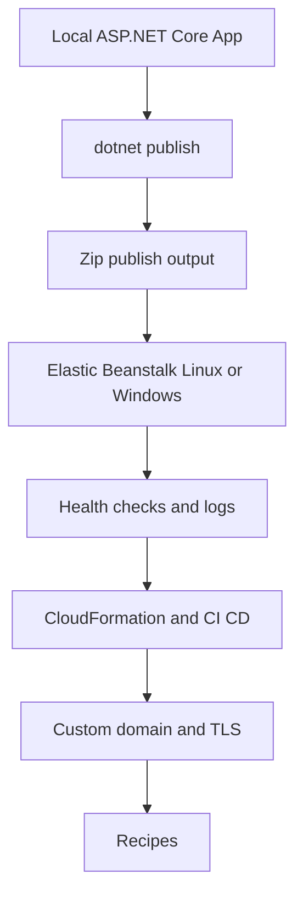

# .NET on AWS Elastic Beanstalk

This track covers ASP.NET Core on AWS Elastic Beanstalk for both supported runtime models:

- Linux with the **.NET 8 on Amazon Linux 2023** platform branch.
- Windows Server with IIS and `aws-windows-deployment-manifest.json`.

The main path in this guide uses Linux because it aligns with the current .NET 8 platform branch, Kestrel behind nginx, and the `PORT` environment variable pattern.

## Prerequisites

- .NET 8 SDK installed locally.
- AWS CLI v2 configured with a default profile and region.
- EB CLI installed.
- IAM permissions for Elastic Beanstalk, EC2, S3, IAM, CloudFormation, CloudWatch Logs, Route 53, and ACM.

```bash
dotnet --info
aws --version
eb --version
aws sts get-caller-identity
```

## What You'll Build

You will build an ASP.NET Core Web API that:

- Runs locally with Kestrel.
- Binds to `PORT` for Linux Elastic Beanstalk parity.
- Publishes to a deployable folder for zip-based deployments.
- Exposes `/health`, `/info`, and `/demo/env` endpoints.
- Adds logging, infrastructure automation, CI/CD, and production recipes.

## Steps

| Step | File | Focus |
|---|---|---|
| 1 | [01-local-run.md](./01-local-run.md) | Local Kestrel run model and `PORT` binding |
| 2 | [02-first-deploy.md](./02-first-deploy.md) | EB CLI initialization, create, and deploy |
| 3 | [03-configuration.md](./03-configuration.md) | `.ebextensions`, environment properties, and configuration precedence |
| 4 | [04-logging-monitoring.md](./04-logging-monitoring.md) | CloudWatch logs, health, and structured logging |
| 5 | [05-infrastructure-as-code.md](./05-infrastructure-as-code.md) | CloudFormation-managed application and environment |
| 6 | [06-ci-cd.md](./06-ci-cd.md) | GitHub Actions build and deployment pipeline |
| 7 | [07-custom-domain-ssl.md](./07-custom-domain-ssl.md) | Route 53 alias and ACM certificate flow |
| 8 | [dotnet-runtime.md](./dotnet-runtime.md) | Linux and Windows runtime behavior |
| 9 | [recipes/index.md](./recipes/index.md) | Service integration and extension patterns |



## Verification

Confirm the workstation and account context before starting:

```bash
dotnet --list-sdks
aws configure list
eb --version
aws elasticbeanstalk list-platform-versions --region "$REGION"
```

Expected outcomes:

- .NET 8 SDK is present.
- AWS CLI is configured for the target account and region.
- EB CLI can reach the Elastic Beanstalk API.
- The account can list Elastic Beanstalk platform versions.

## See Also

- [Language Guides Index](../index.md)
- [Platform Overview](../../platform/index.md)
- [How Elastic Beanstalk Works](../../platform/how-elastic-beanstalk-works.md)
- [.NET Recipes](./recipes/index.md)

## Sources

- [AWS Elastic Beanstalk Developer Guide](https://docs.aws.amazon.com/elasticbeanstalk/latest/dg/Welcome.html)
- [Deploying a .NET application with Elastic Beanstalk](https://docs.aws.amazon.com/elasticbeanstalk/latest/dg/dotnet-core-tutorial.html)
