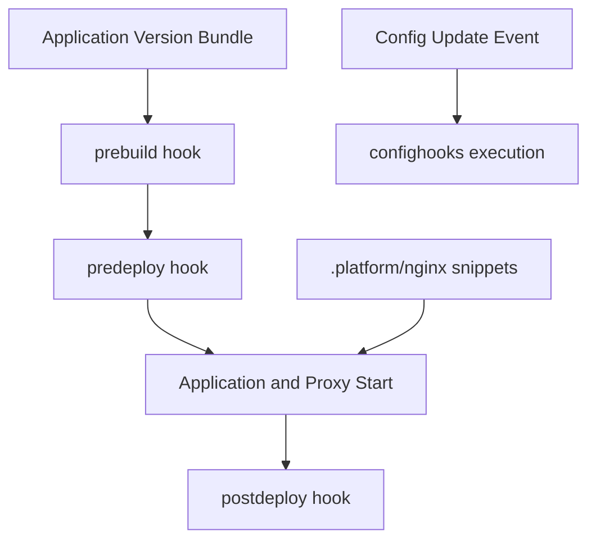

# Customize Platform Hooks and Reverse Proxy Extensions

This tutorial uses Elastic Beanstalk Linux platform extension points for ASP.NET Core environments.
It covers `.platform/hooks/`, `.platform/confighooks/`, and `.platform/nginx/` customization paths.

## Prerequisites

- ASP.NET Core 8.0 environment on Amazon Linux platform branch.
- Shell scripting basics and executable permissions management.
- Access to deployment logs for hook troubleshooting.

## What You'll Build

You will build:

- Lifecycle hook scripts for prebuild, predeploy, and postdeploy.
- Configuration update hooks in `.platform/confighooks/`.
- Optional NGINX snippet extension in `.platform/nginx/`.

## Steps

1. Create hook directories.

```bash
mkdir -p .platform/hooks/prebuild
mkdir -p .platform/hooks/predeploy
mkdir -p .platform/hooks/postdeploy
mkdir -p .platform/confighooks/predeploy
mkdir -p .platform/nginx/conf.d
```

2. Add prebuild hook script.

```bash
#!/usr/bin/env bash
set -o errexit
set -o nounset
set -o pipefail
dotnet --info > /var/app/staging/prebuild-dotnet-info.txt
```

3. Add predeploy hook script.

```bash
#!/usr/bin/env bash
set -o errexit
set -o nounset
set -o pipefail
echo "predeploy start" > /var/log/predeploy-guide.log
```

4. Add postdeploy hook script.

```bash
#!/usr/bin/env bash
set -o errexit
set -o nounset
set -o pipefail
echo "postdeploy complete" > /var/log/postdeploy-guide.log
```

5. Add NGINX custom snippet if needed.

```nginx
location / {
    proxy_pass http://127.0.0.1:5000;
    proxy_http_version 1.1;
    proxy_set_header Connection "";
    proxy_set_header Host $host;
    proxy_set_header X-Forwarded-For $proxy_add_x_forwarded_for;
    proxy_set_header X-Forwarded-Proto $scheme;
}
```

6. Apply executable permissions and deploy.

```bash
chmod +x .platform/hooks/prebuild/*.sh
chmod +x .platform/hooks/predeploy/*.sh
chmod +x .platform/hooks/postdeploy/*.sh
eb deploy --staged
```



## Verification

Inspect logs and generated files:

```bash
eb logs --all
aws elasticbeanstalk describe-events \
    --environment-name "$ENV_NAME" \
    --region "$REGION"
```

Expected outcomes:

- Hook scripts execute in documented lifecycle order.
- Deployment logs include hook script output.
- NGINX customization is reflected after deployment.

## See Also

- [Configuration](../03-configuration.md)
- [.NET Runtime Reference](../dotnet-runtime.md)
- [Docker Deploy Recipe](./docker-deploy.md)

## Sources

- [Extending Linux platforms on Elastic Beanstalk](https://docs.aws.amazon.com/elasticbeanstalk/latest/dg/platforms-linux-extend.html)
- [Reverse proxy configuration](https://docs.aws.amazon.com/elasticbeanstalk/latest/dg/platforms-linux-extend.proxy.html)
