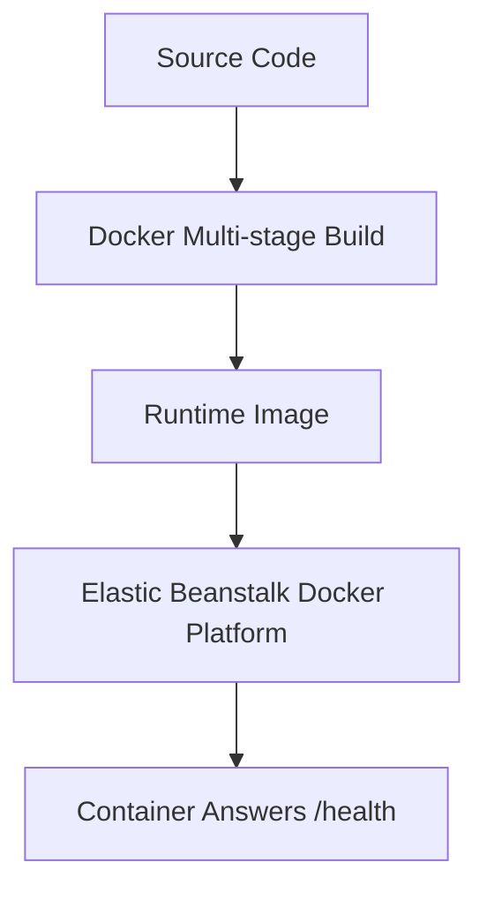

# Deploy ASP.NET Core with Docker on Elastic Beanstalk

This recipe uses Elastic Beanstalk Docker instead of the native .NET platform.
It is useful when you need full control over the runtime image, OS packages, or deployment packaging.

## Prerequisites

- Working ASP.NET Core application.
- Docker installed locally.
- Familiarity with Elastic Beanstalk Docker environments.

## What You'll Build

You will build:

- A multi-stage Dockerfile for ASP.NET Core.
- A Docker-based Elastic Beanstalk deployment package.
- A validation path for the `/health` endpoint.

## Steps

1. Create a multi-stage Dockerfile.

```dockerfile
FROM mcr.microsoft.com/dotnet/sdk:8.0 AS build
WORKDIR /src
COPY . .
RUN dotnet publish GuideApi.csproj --configuration Release --output /app/publish

FROM mcr.microsoft.com/dotnet/aspnet:8.0 AS runtime
WORKDIR /app
COPY --from=build /app/publish .
ENV ASPNETCORE_URLS=http://0.0.0.0:8080
EXPOSE 8080
ENTRYPOINT ["dotnet", "GuideApi.dll"]
```

2. Build the image locally.

```bash
docker build --tag guideapi:latest .
docker run --publish 8080:8080 guideapi:latest
```

3. Create an Elastic Beanstalk Docker environment.

```bash
eb init --platform "Docker running on 64bit Amazon Linux 2023" --region "$REGION"
eb create "$ENV_NAME" --single
eb deploy "$ENV_NAME" --staged
```

4. Validate the deployed container.

```bash
curl --silent "http://$CNAME/health"
```



## Verification

Run these checks after deployment:

```bash
eb status "$ENV_NAME"
eb logs --all
curl --silent "http://$CNAME/health"
```

Expected outcomes:

- The Docker image starts successfully on Elastic Beanstalk.
- The container listens on the expected port.
- `/health` returns `200` through the environment URL.

## See Also

- [First Deploy](../02-first-deploy.md)
- [.NET Runtime Reference](../dotnet-runtime.md)
- [Custom Platform Hooks Recipe](./custom-platform-hooks.md)

## Sources

- [Deploying Docker containers with Elastic Beanstalk](https://docs.aws.amazon.com/elasticbeanstalk/latest/dg/create_deploy_docker.html)
