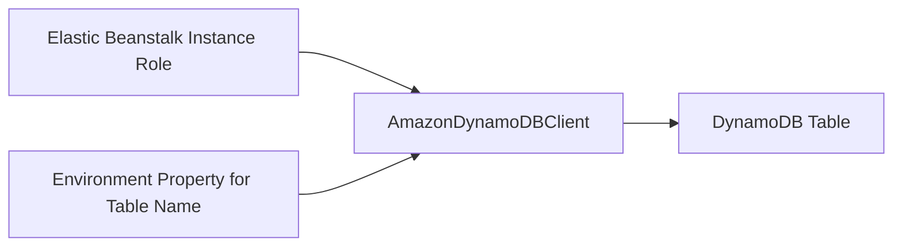

# Add DynamoDB to .NET on Elastic Beanstalk

This recipe shows how to integrate Amazon DynamoDB with an ASP.NET Core application by using the AWS SDK for .NET v3.
It is a good fit when you need fully managed NoSQL storage without running a separate database engine.

## Prerequisites

- Running .NET Elastic Beanstalk environment.
- A DynamoDB table already created or provisioned with infrastructure as code.
- IAM permissions for the instance profile to access the table.
- `AWSSDK.DynamoDBv2` package available in the application.

## What You'll Build

You will build:

- Table name configuration from environment properties.
- A DynamoDB client using the instance profile.
- A simple read or write path for verification.



## Steps

1. Set the DynamoDB table name as an environment property.

```bash
eb setenv APP_TABLE_NAME="${APP_NAME}-items"
```

2. Add the DynamoDB SDK package.

```bash
dotnet add package AWSSDK.DynamoDBv2
```

3. Create the service client and table request model.

```csharp
var client = new AmazonDynamoDBClient();
var response = await client.GetItemAsync(new GetItemRequest
{
    TableName = builder.Configuration["APP_TABLE_NAME"],
    Key = new Dictionary<string, AttributeValue>
    {
        ["Id"] = new AttributeValue { S = "demo" }
    }
});
```

4. Attach least-privilege table permissions to the instance profile role.

5. Deploy and validate read or write operations from the application.

```bash
eb deploy
```

## Verification

Use these checks after deployment:

```bash
eb printenv
eb logs --all
aws dynamodb describe-table --table-name "${APP_NAME}-items" --region "$REGION"
```

Expected outcomes:

- The application reads the table name from configuration.
- The AWS SDK resolves credentials from the instance profile.
- DynamoDB API calls succeed for the target table.
- IAM permissions remain limited to required table actions.

## See Also

- [IAM Instance Profile Recipe](./iam-instance-profile.md)
- [SQS Worker Recipe](./sqs-worker.md)
- [Infrastructure as Code](../05-infrastructure-as-code.md)

## Sources

- [AWS SDK for .NET Developer Guide](https://docs.aws.amazon.com/sdk-for-net/v3/developer-guide/welcome.html)
- [Amazon DynamoDB Developer Guide](https://docs.aws.amazon.com/amazondynamodb/latest/developerguide/Introduction.html)
