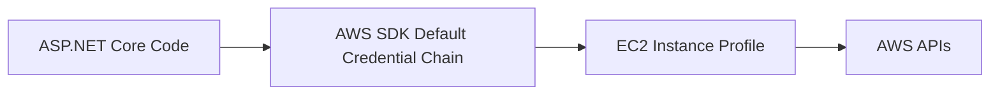

# Use an IAM Instance Profile for AWS Access from ASP.NET Core

This recipe shows the preferred authentication pattern for ASP.NET Core on Elastic Beanstalk: instance profile credentials.
The application calls AWS APIs without embedding access keys in code, configuration files, or environment properties.

## Prerequisites

- Running .NET Elastic Beanstalk environment.
- Ability to update or replace the instance profile attached to EC2 instances.
- Target AWS API permissions defined for the workload.

## What You'll Build

You will configure:

- An EC2 instance profile with least-privilege permissions.
- Elastic Beanstalk environment settings that use that profile.
- ASP.NET Core AWS SDK clients that rely on the default credential chain.

## Steps

1. Create an IAM policy for the exact AWS APIs the app needs.

```json
{
  "Version": "2012-10-17",
  "Statement": [
    {
      "Effect": "Allow",
      "Action": [
        "s3:PutObject",
        "s3:GetObject"
      ],
      "Resource": "arn:aws:s3:::guideapi-storage/*"
    }
  ]
}
```

2. Attach the policy to an instance profile role used by Elastic Beanstalk EC2 instances.

3. Set the environment to use the role.

```yaml
option_settings:
    aws:autoscaling:launchconfiguration:
        IamInstanceProfile: aws-elasticbeanstalk-ec2-role
```

4. Use the AWS SDK without explicit credentials.

```csharp
builder.Services.AddAWSService<IAmazonS3>();
builder.Services.AddAWSService<IAmazonSecretsManager>();
```

5. Confirm the application can call AWS APIs.

```bash
eb deploy "$ENV_NAME" --staged
eb logs --all
```



## Verification

Use these checks to confirm the pattern is working:

```bash
aws elasticbeanstalk describe-configuration-settings --application-name "$APP_NAME" --environment-name "$ENV_NAME" --region "$REGION"
eb logs --all
```

Expected outcomes:

- Elastic Beanstalk instances launch with the expected instance profile.
- SDK calls succeed without static credentials.
- Policies remain scoped to the required resources and actions.

## See Also

- [S3 Storage Recipe](./s3-storage.md)
- [Secrets Manager Recipe](./secrets-manager.md)
- [Infrastructure as Code](../05-infrastructure-as-code.md)

## Sources

- [Managing Elastic Beanstalk instance profiles](https://docs.aws.amazon.com/elasticbeanstalk/latest/dg/iam-instanceprofile.html)
