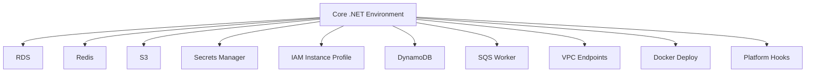

# .NET Recipes on Elastic Beanstalk

This recipe collection extends the core ASP.NET Core track with service integration and platform extension patterns documented by AWS.
Each recipe assumes the base web environment already deploys and passes `/health` checks.

## Prerequisites

- Completed the core .NET guide through deployment and configuration.
- Familiarity with Elastic Beanstalk environment properties and IAM roles.
- AWS SDK for .NET package management.

## What You'll Build

You will add optional capabilities around an ASP.NET Core application:

- Relational data with Amazon RDS and Entity Framework Core.
- Caching with Amazon ElastiCache for Redis.
- Object storage with Amazon S3.
- Secret retrieval with AWS Secrets Manager.
- Instance profile-based authentication without static credentials.
- NoSQL data with Amazon DynamoDB.
- Background processing with Amazon SQS worker environments.
- Private networking with VPC endpoints.
- Docker-based packaging as an alternative runtime path.
- Linux platform lifecycle customization with `.platform/hooks`.

## Steps

| Order | Recipe | Primary Service or Feature | Outcome |
|---|---|---|---|
| 1 | [rds-integration.md](./rds-integration.md) | Amazon RDS | Externalized relational database access |
| 2 | [elasticache-redis.md](./elasticache-redis.md) | Amazon ElastiCache | Low-latency caching |
| 3 | [s3-storage.md](./s3-storage.md) | Amazon S3 | Durable object storage |
| 4 | [secrets-manager.md](./secrets-manager.md) | AWS Secrets Manager | Runtime secret retrieval |
| 5 | [iam-instance-profile.md](./iam-instance-profile.md) | IAM | Least-privilege AWS access |
| 6 | [dynamodb.md](./dynamodb.md) | Amazon DynamoDB | NoSQL data access |
| 7 | [sqs-worker.md](./sqs-worker.md) | Amazon SQS | Background job processing |
| 8 | [vpc-endpoints.md](./vpc-endpoints.md) | VPC Endpoints | Private service connectivity |
| 9 | [docker-deploy.md](./docker-deploy.md) | Docker | Multi-stage container deployment |
| 10 | [custom-platform-hooks.md](./custom-platform-hooks.md) | Linux platform hooks | Prebuild, predeploy, and postdeploy extensions |



## Verification

Before starting any recipe, confirm the baseline environment:

```bash
eb status "$ENV_NAME"
eb printenv
eb logs --all
```

Recipe completion checks should include:

- Service-specific connectivity validation.
- Environment events and health review.
- No secrets or unmasked identifiers in logs or documentation examples.
- IAM permissions narrowed to the required APIs.

## See Also

- [.NET Guide Index](../index.md)
- [.NET Runtime Reference](../dotnet-runtime.md)
- [Operations Section](../../../operations/index.md)

## Sources

- [AWS Elastic Beanstalk Developer Guide](https://docs.aws.amazon.com/elasticbeanstalk/latest/dg/Welcome.html)
