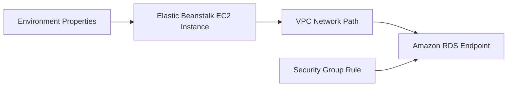

# Integrate Amazon RDS with ASP.NET Core on Elastic Beanstalk

This recipe connects an ASP.NET Core application on Elastic Beanstalk to Amazon RDS using Entity Framework Core.
It follows the recommended pattern of keeping the database lifecycle separate from the Elastic Beanstalk environment lifecycle.

## Prerequisites

- Running .NET Elastic Beanstalk environment.
- Existing Amazon RDS instance reachable from the environment VPC.
- Security group rules allowing database traffic.
- EF Core provider package for your selected engine.

## What You'll Build

You will configure:

- Environment properties for database connectivity.
- An EF Core `DbContext` using a connection string from environment properties.
- A simple database health endpoint.

## Steps

1. Set database connection properties on the environment.

```bash
eb setenv DB_HOST="mydb.xxxxx.ap-northeast-2.rds.amazonaws.com" DB_PORT="5432" DB_NAME="guideapi" DB_USER="guideapi" DB_PASSWORD="<db-password>"
```

2. Add EF Core packages.

```bash
dotnet add GuideApi.csproj package Microsoft.EntityFrameworkCore
dotnet add GuideApi.csproj package Npgsql.EntityFrameworkCore.PostgreSQL
```

3. Register the `DbContext`.

```csharp
builder.Services.AddDbContext<AppDbContext>(options =>
    options.UseNpgsql(
        $"Host={builder.Configuration["DB_HOST"]};" +
        $"Port={builder.Configuration["DB_PORT"]};" +
        $"Database={builder.Configuration["DB_NAME"]};" +
        $"Username={builder.Configuration["DB_USER"]};" +
        $"Password={builder.Configuration["DB_PASSWORD"]}"));
```

4. Add a connectivity check endpoint.

```csharp
app.MapGet("/db-check", async (AppDbContext dbContext) =>
{
    var canConnect = await dbContext.Database.CanConnectAsync();
    return Results.Ok(new { database = canConnect ? "reachable" : "unreachable" });
});
```

5. Deploy and validate connectivity.

```bash
eb deploy "$ENV_NAME" --staged
curl --silent "http://$CNAME/db-check"
```



## Verification

Use these checks after deployment:

```bash
eb printenv
eb logs --all
curl --silent "http://$CNAME/db-check"
```

Expected outcomes:

- Environment variables are present.
- Security groups and subnets allow database connectivity.
- `/db-check` returns a success payload.
- Application logs do not expose the raw password.

## See Also

- [Configuration](../03-configuration.md)
- [Secrets Manager Recipe](./secrets-manager.md)
- [IAM Instance Profile Recipe](./iam-instance-profile.md)

## Sources

- [Using Amazon RDS with Elastic Beanstalk](https://docs.aws.amazon.com/elasticbeanstalk/latest/dg/AWSHowTo.RDS.html)
