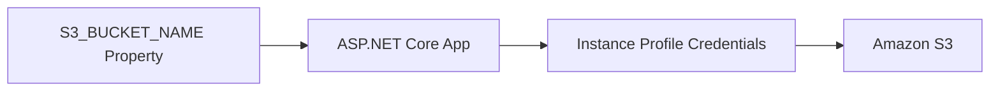

# Use Amazon S3 from ASP.NET Core on Elastic Beanstalk

This recipe adds Amazon S3 object storage to an ASP.NET Core application running on Elastic Beanstalk.
It uses the AWS SDK for .NET and relies on the instance profile instead of static credentials.

## Prerequisites

- Running .NET Elastic Beanstalk environment.
- S3 bucket already created.
- Instance profile policy permitting S3 object operations.

## What You'll Build

You will build:

- SDK registration for Amazon S3.
- A small upload example.
- A configuration pattern using environment properties for the bucket name.

## Steps

1. Set the bucket name as an environment property.

```bash
eb setenv S3_BUCKET_NAME="guideapi-storage"
```

2. Add the SDK package.

```bash
dotnet add GuideApi.csproj package AWSSDK.S3
```

3. Register the S3 client.

```csharp
builder.Services.AddDefaultAWSOptions(builder.Configuration.GetAWSOptions());
builder.Services.AddAWSService<IAmazonS3>();
```

4. Add an example upload endpoint.

```csharp
app.MapPost("/s3-check", async (IAmazonS3 s3, IConfiguration configuration) =>
{
    using var stream = new MemoryStream(System.Text.Encoding.UTF8.GetBytes("ok"));
    await s3.PutObjectAsync(new PutObjectRequest
    {
        BucketName = configuration["S3_BUCKET_NAME"],
        Key = "health/guide.txt",
        InputStream = stream
    });

    return Results.Ok(new { s3 = "uploaded" });
});
```

5. Deploy and verify access.

```bash
eb deploy "$ENV_NAME" --staged
curl --request POST --silent "http://$CNAME/s3-check"
```



## Verification

Use these checks after deployment:

```bash
eb printenv
eb logs --all
aws s3 ls "s3://guideapi-storage/health/" --region "$REGION"
```

Expected outcomes:

- The application uploads to the correct bucket.
- The instance profile provides credentials automatically.
- No access keys are stored in source or environment properties.

## See Also

- [IAM Instance Profile Recipe](./iam-instance-profile.md)
- [Secrets Manager Recipe](./secrets-manager.md)
- [Configuration](../03-configuration.md)

## Sources

- [Using the AWS SDK for .NET in Elastic Beanstalk](https://docs.aws.amazon.com/elasticbeanstalk/latest/dg/dotnet-aws-sdk.html)
