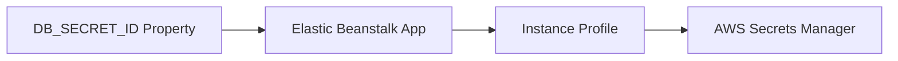

# Retrieve Secrets from AWS Secrets Manager in ASP.NET Core

This recipe moves sensitive settings out of Elastic Beanstalk environment properties and into AWS Secrets Manager.
The application reads a secret at runtime by using the instance profile.

## Prerequisites

- Running .NET Elastic Beanstalk environment.
- Secret already stored in AWS Secrets Manager.
- Instance profile permission for `secretsmanager:GetSecretValue`.

## What You'll Build

You will build:

- Environment property that stores only the secret identifier.
- AWS SDK code to retrieve the secret value.
- A pattern that keeps secrets out of source bundles and Elastic Beanstalk console output.

## Steps

1. Set the secret identifier as an environment property.

```bash
eb setenv DB_SECRET_ID="guideapi/prod/database"
```

2. Add the SDK package.

```bash
dotnet add GuideApi.csproj package AWSSDK.SecretsManager
```

3. Register the Secrets Manager client.

```csharp
builder.Services.AddAWSService<IAmazonSecretsManager>();
```

4. Retrieve the secret value at runtime.

```csharp
app.MapGet("/secret-check", async (IAmazonSecretsManager secretsManager, IConfiguration configuration) =>
{
    var response = await secretsManager.GetSecretValueAsync(new GetSecretValueRequest
    {
        SecretId = configuration["DB_SECRET_ID"]
    });

    return Results.Ok(new { secret = "retrieved", length = response.SecretString?.Length ?? 0 });
});
```

5. Deploy and verify.

```bash
eb deploy "$ENV_NAME" --staged
curl --silent "http://$CNAME/secret-check"
```



## Verification

Use these checks after deployment:

```bash
eb printenv
eb logs --all
curl --silent "http://$CNAME/secret-check"
```

Expected outcomes:

- Only the secret identifier appears in environment properties.
- The application can retrieve the secret at runtime.
- Secret contents are not written to logs or returned to clients.

## See Also

- [IAM Instance Profile Recipe](./iam-instance-profile.md)
- [RDS Integration Recipe](./rds-integration.md)
- [Configuration](../03-configuration.md)

## Sources

- [Using AWS Secrets Manager secrets in Elastic Beanstalk environments](https://docs.aws.amazon.com/elasticbeanstalk/latest/dg/AWSHowTo.secrets.env-vars.html)
