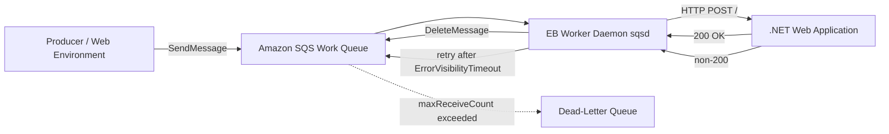

# Run a .NET SQS Worker Environment on Elastic Beanstalk

This recipe shows how to process asynchronous workloads with a .NET application in an Elastic Beanstalk worker environment.
The worker tier's built-in SQS daemon polls the queue and delivers each message as an HTTP POST to your application.
Your .NET code only needs to handle HTTP requests — it never calls the SQS API directly.

## Prerequisites

- Familiarity with Elastic Beanstalk environment tiers (web server vs worker).
- AWS CLI, EB CLI, and .NET 8 SDK installed locally.
- An Elastic Beanstalk application already initialized for your repository.
- IAM permissions for Elastic Beanstalk, Amazon SQS, and CloudWatch Logs.

## What You'll Build

- A main SQS queue for background jobs and a dead-letter queue (DLQ) for poison messages.
- An Elastic Beanstalk worker environment created with `--tier worker`.
- A .NET web application that receives SQS messages as HTTP POST requests from the worker daemon and returns `200 OK` on success.



## Steps

1. Create the DLQ first, then create the work queue with a redrive policy.

    ```bash
    aws sqs create-queue \
        --queue-name "${APP_NAME}-jobs-dlq" \
        --region "$REGION"

    DLQ_ARN=$(aws sqs get-queue-attributes \
        --queue-url "https://sqs.${REGION}.amazonaws.com/<account-id>/${APP_NAME}-jobs-dlq" \
        --attribute-names QueueArn \
        --query 'Attributes.QueueArn' \
        --output text \
        --region "$REGION")

    aws sqs create-queue \
        --queue-name "${APP_NAME}-jobs" \
        --attributes "VisibilityTimeout=120,ReceiveMessageWaitTimeSeconds=20,RedrivePolicy={\"deadLetterTargetArn\":\"${DLQ_ARN}\",\"maxReceiveCount\":\"5\"}" \
        --region "$REGION"
    ```

2. Create a minimal .NET web project. The worker daemon handles all SQS interaction, so no SQS SDK is needed in the application itself.

    ```xml
    <Project Sdk="Microsoft.NET.Sdk.Web">
      <PropertyGroup>
        <TargetFramework>net8.0</TargetFramework>
        <Nullable>enable</Nullable>
        <ImplicitUsings>enable</ImplicitUsings>
      </PropertyGroup>
    </Project>
    ```

3. Implement the HTTP handler that the worker daemon calls. The daemon POSTs each SQS message body to the configured `HttpPath` (default `/`). Return `200 OK` after successful processing — the daemon deletes the message. Return any non-200 status and the daemon returns the message to the queue for retry.

    ```csharp
    var builder = WebApplication.CreateBuilder(args);
    var app = builder.Build();

    app.MapGet("/health", () => Results.Ok(new { status = "ok" }));

    app.MapPost("/", async (HttpContext context, ILogger<Program> logger) =>
    {
        using var reader = new StreamReader(context.Request.Body);
        var body = await reader.ReadToEndAsync();

        var sqsMessageId = context.Request.Headers["X-Aws-Sqsd-Msgid"].FirstOrDefault() ?? "unknown";
        var receiveCount = context.Request.Headers["X-Aws-Sqsd-Receive-Count"].FirstOrDefault() ?? "1";

        logger.LogInformation("Processing SQS message {MessageId} receive-count={ReceiveCount}", sqsMessageId, receiveCount);

        using var document = System.Text.Json.JsonDocument.Parse(body);
        var jobType = document.RootElement.GetProperty("jobType").GetString();
        var jobId = document.RootElement.GetProperty("jobId").GetString();

        if (string.IsNullOrWhiteSpace(jobType) || string.IsNullOrWhiteSpace(jobId))
        {
            logger.LogError("Invalid message schema — missing jobType or jobId");
            return Results.BadRequest("jobType and jobId are required");
        }

        // Replace with your actual business logic
        await Task.Delay(TimeSpan.FromSeconds(2));

        logger.LogInformation("Completed job {JobId} type={JobType}", jobId, jobType);
        return Results.Ok();
    });

    app.Run();
    ```

    !!! tip
        The worker daemon injects SQS metadata as HTTP headers. Use `X-Aws-Sqsd-Msgid` for the SQS message ID, `X-Aws-Sqsd-Receive-Count` for retry tracking, and `X-Aws-Sqsd-Queue` for the source queue URL.

4. Add a `Procfile` so Elastic Beanstalk starts the application process.

    ```text
    web: dotnet ./MyApp.dll
    ```

5. Configure worker daemon settings with `.ebextensions/worker.config`.

    ```yaml
    option_settings:
      aws:elasticbeanstalk:sqsd:
        WorkerQueueURL: "https://sqs.$REGION.amazonaws.com/<account-id>/${APP_NAME}-jobs"
        HttpPath: "/"
        MimeType: "application/json"
        VisibilityTimeout: 120
        ErrorVisibilityTimeout: 30
        InactivityTimeout: 299
        MaxRetries: 5
    ```

    - `VisibilityTimeout` must exceed worst-case processing time so in-progress messages are not redelivered.
    - `ErrorVisibilityTimeout` controls how quickly a failed message becomes visible again for retry.
    - `MaxRetries` works alongside the queue's `maxReceiveCount` redrive policy.
    - `InactivityTimeout` sets the HTTP connection timeout between the daemon and your application.

6. Create the worker environment and deploy.

    ```bash
    eb create "$ENV_NAME" \
        --tier worker \
        --region "$REGION" \
        --single \
        --instance_type t3.small

    eb deploy "$ENV_NAME" --staged
    ```

    !!! warning
        Do not configure your application to poll SQS directly when running on the worker tier. The worker daemon already handles polling, message deletion, and retry. Running both consumers against the same queue causes duplicate processing and unpredictable message deletion.

7. Send a test message that matches the handler contract.

    ```bash
    aws sqs send-message \
        --queue-url "https://sqs.${REGION}.amazonaws.com/<account-id>/${APP_NAME}-jobs" \
        --message-body '{"jobType":"send-email","jobId":"job-001"}' \
        --region "$REGION"
    ```

8. Monitor queue depth, in-flight work, and DLQ movement.

    ```bash
    aws sqs get-queue-attributes \
        --queue-url "https://sqs.${REGION}.amazonaws.com/<account-id>/${APP_NAME}-jobs" \
        --attribute-names ApproximateNumberOfMessages ApproximateNumberOfMessagesNotVisible \
        --region "$REGION"

    aws sqs get-queue-attributes \
        --queue-url "https://sqs.${REGION}.amazonaws.com/<account-id>/${APP_NAME}-jobs-dlq" \
        --attribute-names ApproximateNumberOfMessages \
        --region "$REGION"
    ```

    - Make handlers idempotent because SQS provides at-least-once delivery.
    - If work often exceeds 120 seconds, raise both queue `VisibilityTimeout` and daemon `VisibilityTimeout` together.

## Verification

Use these checks after deployment:

```bash
eb status "$ENV_NAME"
eb health "$ENV_NAME"
eb logs --all
```

Expected outcomes:

- The worker environment is healthy and `Ready`.
- Test messages leave the main queue after successful processing.
- Application logs show `Processing SQS message` and `Completed job` entries.
- Failed messages reappear after the `ErrorVisibilityTimeout` and move to the DLQ after exceeding `maxReceiveCount`.

Failure-mode guidance:

- If the same message returns too quickly, the `VisibilityTimeout` is shorter than the processing time.
- If messages disappear without business effect, your handler returns `200 OK` before the downstream operation completes.
- If the DLQ grows steadily, inspect schema mismatches, downstream failures, and idempotency gaps.
- If queue depth rises while the environment looks healthy, your arrival rate exceeds single-instance throughput — scale up or add instances.

## See Also

- [Environment Tiers](../../../platform/environment-tiers.md)
- [DynamoDB Recipe](./dynamodb.md)
- [CI/CD](../06-ci-cd.md)

## Sources

- [Worker environments](https://docs.aws.amazon.com/elasticbeanstalk/latest/dg/using-features-managing-env-tiers.html)
- [Configuring worker environments](https://docs.aws.amazon.com/elasticbeanstalk/latest/dg/using-features-managing-env-tiers.html#worker-environ)
- [Amazon SQS visibility timeout](https://docs.aws.amazon.com/AWSSimpleQueueService/latest/SQSDeveloperGuide/sqs-visibility-timeout.html)
- [Using dead-letter queues in Amazon SQS](https://docs.aws.amazon.com/AWSSimpleQueueService/latest/SQSDeveloperGuide/sqs-dead-letter-queues.html)
