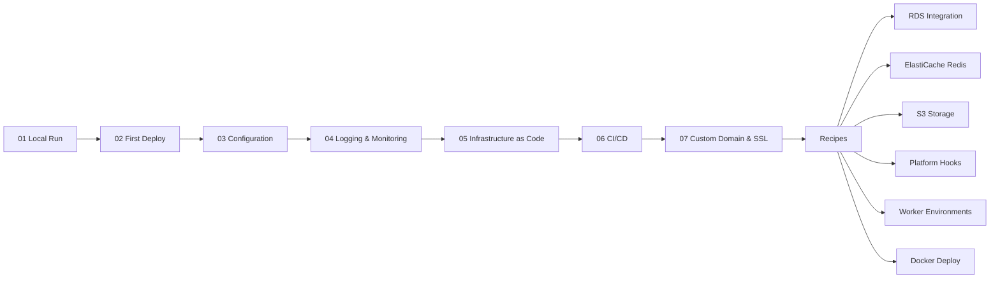

---
hide:
  - toc
---

# Language Guides

This section provides step-by-step tutorials for deploying and operating web applications on AWS Elastic Beanstalk using four language tracks: **Python (Flask)**, **Node.js (Express)**, **Java (Spring Boot)**, and **.NET (ASP.NET Core)**.

Each track follows an identical progression from local development through production-ready configuration, giving you a consistent learning path regardless of your runtime.

## Tutorial Progression

All language tracks share the same seven-step structure, followed by targeted recipes for common integration patterns.

## Available Language Tracks

### Python (Flask)

The Python track uses a Flask reference application with Gunicorn as the WSGI server. It covers Python-specific platform behavior, pip dependency management, and WSGI configuration.

- [Python Language Guide](python/index.md) — Start here for the Python track
- [Python Runtime Reference](python/python-runtime.md) — Platform versions, WSGI, Procfile
- [Python Recipes](python/recipes/index.md) — Integration patterns for RDS, Redis, S3, and more

### Node.js (Express)

The Node.js track uses an Express reference application with npm for dependency management. It covers Node.js-specific platform behavior, proxy configuration, and process management.

- [Node.js Language Guide](nodejs/index.md) — Start here for the Node.js track
- [Node.js Runtime Reference](nodejs/nodejs-runtime.md) — Platform versions, npm, nginx proxy
- [Node.js Recipes](nodejs/recipes/index.md) — Integration patterns for RDS, Redis, S3, and more

### Java (Spring Boot)

The Java track uses a Spring Boot reference application with Maven for packaging and a fat JAR startup model. It covers Corretto platform behavior, Spring profiles, `Procfile` startup, and AWS SDK for Java v2 integrations.

- [Java Language Guide](java/index.md) — Start here for the Java track
- [Java Runtime Reference](java/java-runtime.md) — Corretto versions, JVM tuning, Procfile, and configuration
- [Java Recipes](java/recipes/index.md) — Integration patterns for RDS, Redis, S3, Secrets Manager, and more

### .NET (ASP.NET Core)

The .NET track uses an ASP.NET Core 8 reference application with Kestrel, self-contained Linux deployment, and a `Procfile` for Elastic Beanstalk startup. It covers environment-based configuration, CloudWatch logging patterns, AWS SDK for .NET v3 integrations, and Docker-based alternatives.

- [.NET Language Guide](dotnet/index.md) — Start here for the .NET track
- [.NET Runtime Reference](dotnet/dotnet-runtime.md) — AL2023 runtime, publish model, Procfile, and configuration
- [.NET Recipes](dotnet/recipes/index.md) — Integration patterns for RDS, Redis, S3, DynamoDB, Secrets Manager, and more

## Choosing a Track

| Factor | Python (Flask) | Node.js (Express) | Java (Spring Boot) | .NET (ASP.NET Core) |
|---|---|---|---|---|
| App server | Gunicorn via Procfile | Node.js built-in HTTP | Embedded Tomcat via `java -jar` | Kestrel via published binary |
| Reverse proxy | nginx (default) | nginx (default) | nginx (default) | nginx (default) |
| Dependency file | `requirements.txt` | `package.json` | `pom.xml` | `*.csproj` |
| Process definition | `Procfile` | `Procfile` or `npm start` | `Procfile` | `Procfile` with self-contained executable |
| Platform hooks | Bash scripts in `.platform/hooks/` | Bash scripts in `.platform/hooks/` | Bash scripts in `.platform/hooks/` | Bash scripts in `.platform/hooks/` |
| Static files | Typically served via S3 or nginx | Typically served via Express static or nginx | Typically served via Spring MVC, S3, or nginx | Static files or reverse proxy offload |

All tracks use identical Elastic Beanstalk features. The choice depends on your team's language preference and existing application stack.

## Reference Applications

Each track includes a minimal reference application in the `apps/` directory at the repository root:

- `apps/python-flask/` — Flask app with health and info endpoints
- `apps/nodejs/` — Express app with health and info endpoints
- `apps/java-springboot/` — Spring Boot app with health and info endpoints
- `apps/dotnet-aspnetcore/` — ASP.NET Core app with health and info endpoints

These applications serve as the starting point for each tutorial step.

## See Also

- [Start Here — Overview](../start-here/overview.md)
- [Start Here — Learning Paths](../start-here/learning-paths.md)
- [Platform — How Elastic Beanstalk Works](../platform/how-elastic-beanstalk-works.md)
- [Best Practices — Deployment](../best-practices/deployment.md)

## Sources

- [AWS Elastic Beanstalk Developer Guide — Creating and Deploying Python Applications](https://docs.aws.amazon.com/elasticbeanstalk/latest/dg/create-deploy-python-flask.html)
- [AWS Elastic Beanstalk Developer Guide — Creating and Deploying Node.js Applications](https://docs.aws.amazon.com/elasticbeanstalk/latest/dg/create_deploy_nodejs_express.html)
- [AWS Elastic Beanstalk Developer Guide — Deploying a Spring Boot application to Elastic Beanstalk](https://docs.aws.amazon.com/elasticbeanstalk/latest/dg/java-spring-tutorial.html)
- [AWS Elastic Beanstalk Developer Guide — Deploying .NET applications](https://docs.aws.amazon.com/elasticbeanstalk/latest/dg/create_deploy_NET.html)
