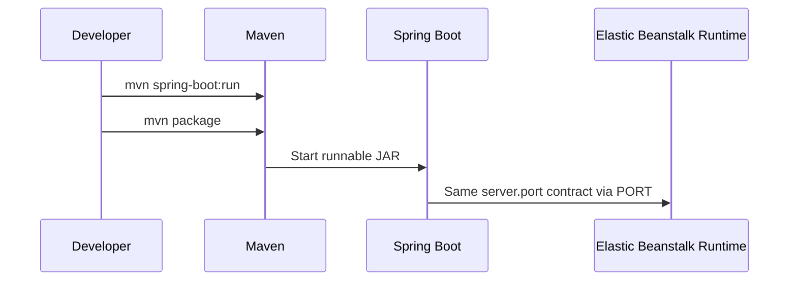

# Run a Spring Boot App Locally for Elastic Beanstalk

This tutorial prepares a Spring Boot project for AWS Elastic Beanstalk Java by making the local startup contract match the deployment runtime.
The target runtime is a runnable JAR behind the Elastic Beanstalk nginx reverse proxy, with Spring Boot listening on the `PORT` environment variable.

## Prerequisites

- Java 17 installed locally.
- Maven installed locally.
- A clean project folder or the reference app from `apps/java-springboot/`.

## What You'll Build

You will build a minimal Spring Boot app that:

- Runs locally with `mvn spring-boot:run`.
- Packages with `mvn package`.
- Reads `PORT` through `server.port=${PORT:5000}`.
- Exposes `/health`, `/info`, and `/demo/env` endpoints.

Project target structure:

```text
.
├── pom.xml
├── Procfile
├── .ebextensions/
│   └── 01-jvm.config
└── src/
    └── main/
        ├── java/com/example/guide/
        │   ├── GuideApplication.java
        │   └── controller/
        └── resources/application.properties
```



## Steps

1. Create the Maven project file.

```xml
<project xmlns="http://maven.apache.org/POM/4.0.0"
         xmlns:xsi="http://www.w3.org/2001/XMLSchema-instance"
         xsi:schemaLocation="http://maven.apache.org/POM/4.0.0 https://maven.apache.org/xsd/maven-4.0.0.xsd">
    <modelVersion>4.0.0</modelVersion>
    <parent>
        <groupId>org.springframework.boot</groupId>
        <artifactId>spring-boot-starter-parent</artifactId>
        <version>3.3.5</version>
        <relativePath/>
    </parent>
    <groupId>com.example</groupId>
    <artifactId>guide</artifactId>
    <version>0.0.1-SNAPSHOT</version>
    <properties>
        <java.version>17</java.version>
    </properties>
    <dependencies>
        <dependency>
            <groupId>org.springframework.boot</groupId>
            <artifactId>spring-boot-starter-web</artifactId>
        </dependency>
        <dependency>
            <groupId>org.springframework.boot</groupId>
            <artifactId>spring-boot-starter-actuator</artifactId>
        </dependency>
    </dependencies>
    <build>
        <plugins>
            <plugin>
                <groupId>org.springframework.boot</groupId>
                <artifactId>spring-boot-maven-plugin</artifactId>
            </plugin>
        </plugins>
    </build>
</project>
```

2. Create the Spring Boot entrypoint.

```java
package com.example.guide;

import org.springframework.boot.SpringApplication;
import org.springframework.boot.autoconfigure.SpringBootApplication;

@SpringBootApplication
public class GuideApplication {
    public static void main(String[] args) {
        SpringApplication.run(GuideApplication.class, args);
    }
}
```

3. Create the application properties file.

```properties
spring.application.name=aws-eb-java-reference
server.port=${PORT:5000}
management.endpoints.web.exposure.include=health,info
```

4. Add simple controllers.

```java
package com.example.guide.controller;

import java.util.Map;
import org.springframework.web.bind.annotation.GetMapping;
import org.springframework.web.bind.annotation.RestController;

@RestController
public class DemoController {
    @GetMapping("/")
    public Map<String, Object> index() {
        return Map.of("status", "running", "health", "/health");
    }
}
```

5. Run the application locally.

```bash
mvn spring-boot:run
```

6. Test the same port contract Elastic Beanstalk uses.

```bash
PORT=5000 mvn spring-boot:run
curl --verbose "http://127.0.0.1:5000/health"
```

7. Package the application into a JAR.

```bash
mvn clean package
```

8. Create the `Procfile` that Elastic Beanstalk will use.

```text
web: java -jar target/guide-0.0.1-SNAPSHOT.jar
```

## Verification

Run these checks before any Elastic Beanstalk deployment:

```bash
mvn test
mvn package
java -jar target/guide-0.0.1-SNAPSHOT.jar
curl --verbose "http://127.0.0.1:5000/info"
```

Expected results:

- Maven build succeeds.
- The JAR starts without additional arguments.
- `/health` and `/info` respond on port `5000` locally.
- The app reads `PORT` when provided.

## See Also

- [First Deploy](./02-first-deploy.md)
- [Java Runtime on AL2023](./java-runtime.md)
- [Platform Overview](../../platform/index.md)

## Sources

- [Deploying Java applications to Elastic Beanstalk](https://docs.aws.amazon.com/elasticbeanstalk/latest/dg/create_deploy_Java.html)
- [Configuring environment properties](https://docs.aws.amazon.com/elasticbeanstalk/latest/dg/environments-cfg-softwaresettings.html)
