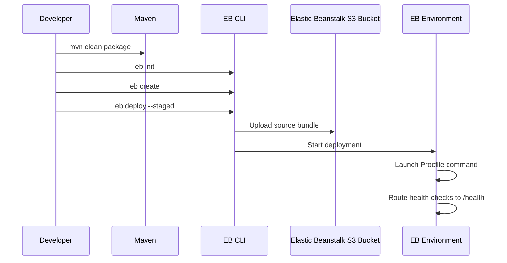

# First Spring Boot Deployment to Elastic Beanstalk

This tutorial walks through a first Spring Boot deployment using a runnable JAR, a `Procfile`, and the Corretto 17 platform branch on 64bit Amazon Linux 2023.
The goal is to make the startup contract explicit and keep the deployment bundle predictable.

## Prerequisites

- Completed local setup from `01-local-run.md`.
- EB CLI authenticated through your configured AWS CLI profile.
- A working Spring Boot project that packages as `target/guide-0.0.1-SNAPSHOT.jar`.
- IAM permissions to create Elastic Beanstalk applications and environments.

## What You'll Build

You will initialize Elastic Beanstalk metadata, create a web server environment, deploy the application version, and validate health through `/health`.



## Steps

1. Package the application.

```bash
mvn clean package
```

2. Confirm the project root contains the JAR path expected by `Procfile`.

```text
web: java -jar target/guide-0.0.1-SNAPSHOT.jar
```

3. Initialize Elastic Beanstalk metadata.

```bash
eb init
```

During prompts, select:

- The target `$REGION`.
- Existing or new application named `$APP_NAME`.
- The platform branch **Corretto 17 running on 64bit Amazon Linux 2023**.

4. Create the environment with an explicit CNAME and health check path.

```bash
eb create "$ENV_NAME" --cname "$ENV_NAME" --envvars SPRING_PROFILES_ACTIVE=prod
```

5. Configure `/health` as the application health check path.

```yaml
option_settings:
    aws:elasticbeanstalk:environment:process:default:
        HealthCheckPath: /health
```

6. Deploy the current application version.

```bash
eb deploy --staged
```

7. Inspect the environment.

```bash
eb status
eb health
eb events
eb open
```

8. Validate the deployment URL directly.

```bash
curl --verbose "http://$ENV_NAME.$REGION.elasticbeanstalk.com/health"
```

## Verification

Use these checks after deployment:

```bash
eb status "$ENV_NAME"
eb health "$ENV_NAME"
eb logs --all
aws elasticbeanstalk describe-environments --application-name "$APP_NAME" --environment-names "$ENV_NAME" --region "$REGION"
```

Expected outcomes:

- The environment reaches `Ready` state.
- Health is `Green`.
- The endpoint responds from the Spring Boot app.
- Logs show Elastic Beanstalk launching the JAR from `Procfile`.

## See Also

- [Run Locally](./01-local-run.md)
- [Configuration](./03-configuration.md)
- [How Elastic Beanstalk Works](../../platform/how-elastic-beanstalk-works.md)

## Sources

- [Deploying Java applications to Elastic Beanstalk](https://docs.aws.amazon.com/elasticbeanstalk/latest/dg/create_deploy_Java.html)
- [Deploying an application to Elastic Beanstalk environments](https://docs.aws.amazon.com/elasticbeanstalk/latest/dg/using-features.deploy-existing-version.html)
