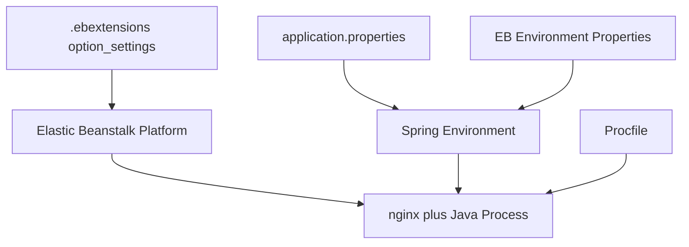

# Configure Spring Boot on Elastic Beanstalk

This tutorial covers the main configuration layers for Spring Boot on Elastic Beanstalk: application properties, environment properties, `Procfile`, and `.ebextensions`.
The objective is to make runtime settings explicit, source-controlled, and repeatable across environments.

## Prerequisites

- Running Java Elastic Beanstalk environment.
- Spring Boot app deployed once successfully.
- Familiarity with Maven packaging and the `PORT` contract.

## What You'll Build

You will build:

- Environment-property driven application configuration.
- A source-controlled health check and JVM tuning baseline.
- A `Procfile` startup contract for the JAR.



## Steps

1. Keep port binding inside `application.properties`.

```properties
server.port=${PORT:5000}
spring.application.name=aws-eb-java-reference
logging.level.root=${LOG_LEVEL:INFO}
app.environment=${ENV_NAME:local}
```

2. Set runtime environment properties through Elastic Beanstalk.

```bash
eb setenv ENV_NAME=production APP_VERSION=2026-04-07 LOG_LEVEL=INFO FEATURE_DEMO=true
```

3. Read those values in Spring Boot.

```java
package com.example.guide.controller;

import java.util.Map;
import org.springframework.beans.factory.annotation.Value;
import org.springframework.web.bind.annotation.GetMapping;
import org.springframework.web.bind.annotation.RestController;

@RestController
public class ConfigController {
    @Value("${app.environment:local}")
    private String environment;

    @GetMapping("/demo/config")
    public Map<String, String> config() {
        return Map.of("environment", environment);
    }
}
```

4. Keep the startup command in `Procfile`.

```text
web: java -jar target/guide-0.0.1-SNAPSHOT.jar
```

5. Add a health check path and JVM options with `.ebextensions`.

```yaml
option_settings:
    aws:elasticbeanstalk:environment:process:default:
        HealthCheckPath: /health
    aws:elasticbeanstalk:container:java:jvmoptions:
        Xms: 256m
        Xmx: 512m
        XX: +UseG1GC
```

6. Add an environment file for a larger example.

```yaml
option_settings:
    aws:elasticbeanstalk:application:environment:
        SPRING_PROFILES_ACTIVE: prod
        SERVER_FORWARD_HEADERS_STRATEGY: framework
```

7. Redeploy configuration changes.

```bash
eb deploy --staged
```

## Verification

Use these checks after applying configuration:

```bash
eb printenv
eb config
eb logs --all
curl --verbose "http://$CNAME/demo/env"
```

Expected outcomes:

- Environment properties are visible in Elastic Beanstalk.
- The app reads expected values without hardcoding secrets.
- `/health` remains the configured health check path.
- JVM settings are captured in source-controlled config files.

## See Also

- [First Deploy](./02-first-deploy.md)
- [Logging and Monitoring](./04-logging-monitoring.md)
- [Java Runtime](./java-runtime.md)

## Sources

- [Advanced environment customization with configuration files](https://docs.aws.amazon.com/elasticbeanstalk/latest/dg/ebextensions.html)
- [Configuring environment properties and other software settings](https://docs.aws.amazon.com/elasticbeanstalk/latest/dg/environments-cfg-softwaresettings.html)
