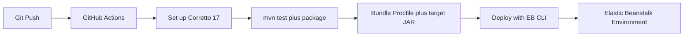

# Build and Deploy Spring Boot with GitHub Actions

This tutorial shows a GitHub Actions workflow that builds a Spring Boot application, packages the Elastic Beanstalk bundle, uploads it to S3, and deploys it with the EB CLI.
The pipeline keeps build and deployment steps reproducible and versioned.

## Prerequisites

- Spring Boot project stored in GitHub.
- Elastic Beanstalk application and environment already created.
- GitHub repository secrets for AWS credentials, region, application name, and environment name.
- IAM permissions for S3 and Elastic Beanstalk deployment operations.

## What You'll Build

You will build a pipeline that:

- Checks out code and sets up Corretto 17.
- Runs Maven tests and packaging.
- Produces an application bundle for Elastic Beanstalk.
- Deploys the new application version to an existing environment.



## Steps

1. Store required GitHub repository secrets:

- `AWS_ACCESS_KEY_ID`
- `AWS_SECRET_ACCESS_KEY`
- `AWS_REGION`
- `EB_APPLICATION_NAME`
- `EB_ENVIRONMENT_NAME`

2. Create `.github/workflows/java-eb-deploy.yml`.

```yaml
name: Deploy Java to Elastic Beanstalk

on:
    push:
        branches:
            - main

jobs:
    deploy:
        runs-on: ubuntu-latest
        steps:
            - name: Check out repository
              uses: actions/checkout@v4

            - name: Set up Corretto 17
              uses: actions/setup-java@v4
              with:
                  distribution: corretto
                  java-version: '17'
                  cache: maven

            - name: Install EB CLI
              run: pip install awsebcli

            - name: Configure AWS credentials
              uses: aws-actions/configure-aws-credentials@v4
              with:
                  aws-access-key-id: ${{ secrets.AWS_ACCESS_KEY_ID }}
                  aws-secret-access-key: ${{ secrets.AWS_SECRET_ACCESS_KEY }}
                  aws-region: ${{ secrets.AWS_REGION }}

            - name: Build application
              run: mvn --batch-mode clean verify package

            - name: Deploy to Elastic Beanstalk
              run: |
                  eb init ${{ secrets.EB_APPLICATION_NAME }} --platform "Corretto 17 running on 64bit Amazon Linux 2023" --region ${{ secrets.AWS_REGION }}
                  eb use ${{ secrets.EB_ENVIRONMENT_NAME }}
                  eb deploy ${{ secrets.EB_ENVIRONMENT_NAME }} --staged
```

3. Keep `Procfile` and `.ebextensions/` in the repository root of the application bundle.

4. Protect `main` with pull request review and required status checks.

5. Add a smoke test job if you want post-deploy verification.

```bash
curl --fail --silent "http://$CNAME/health"
```

## Verification

Use these checks after the workflow runs:

```bash
eb status "$ENV_NAME"
eb events "$ENV_NAME"
aws elasticbeanstalk describe-events --application-name "$APP_NAME" --environment-name "$ENV_NAME" --max-items 10 --region "$REGION"
```

Expected outcomes:

- GitHub Actions completes the Maven build successfully.
- Elastic Beanstalk receives a new application version.
- The target environment deploys without manual workstation steps.
- `/health` remains reachable after deployment.

## See Also

- [Infrastructure as Code](./05-infrastructure-as-code.md)
- [Logging and Monitoring](./04-logging-monitoring.md)
- [First Deploy](./02-first-deploy.md)

## Sources

- [Deploying an application to Elastic Beanstalk environments](https://docs.aws.amazon.com/elasticbeanstalk/latest/dg/using-features.deploy-existing-version.html)
- [Elastic Beanstalk application versions](https://docs.aws.amazon.com/elasticbeanstalk/latest/dg/applications-versions.html)
