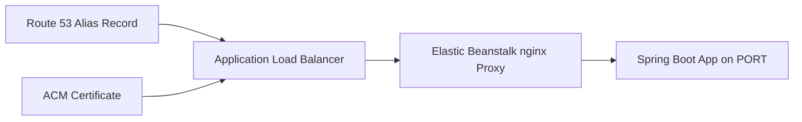

# Add a Custom Domain and TLS to a Spring Boot Environment

This tutorial shows how to map a Route 53 record to an Elastic Beanstalk environment and terminate TLS with AWS Certificate Manager.
The usual production pattern is Elastic Load Balancing in front of the Elastic Beanstalk instances, with Spring Boot still serving HTTP behind the load balancer and nginx proxy.

## Prerequisites

- Running Java Elastic Beanstalk environment.
- Route 53 hosted zone for your domain.
- ACM certificate in the same Region as the Elastic Beanstalk load balancer.
- IAM permissions for ACM, Elastic Load Balancing, Route 53, and Elastic Beanstalk.

## What You'll Build

You will build:

- An ACM certificate for your application hostname.
- An HTTPS listener on the environment load balancer.
- A Route 53 alias record pointing your hostname to Elastic Beanstalk.



## Steps

1. Request or import an ACM certificate.

```bash
aws acm request-certificate --domain-name "app.example.com" --validation-method DNS --region "$REGION"
```

2. Find the load balancer attached to the environment.

```bash
aws elasticbeanstalk describe-environment-resources --environment-name "$ENV_NAME" --region "$REGION"
```

3. Add an HTTPS listener and certificate through Elastic Beanstalk configuration.

```yaml
option_settings:
    aws:elbv2:listener:443:
        DefaultProcess: default
        ListenerEnabled: true
        Protocol: HTTPS
        SSLCertificateArns: arn:aws:acm:$REGION:<account-id>:certificate/<certificate-id>
```

4. Keep the application health path on `/health` for the default process.

```yaml
option_settings:
    aws:elasticbeanstalk:environment:process:default:
        HealthCheckPath: /health
```

5. Create the Route 53 alias record that targets the load balancer DNS name.

```bash
aws route53 change-resource-record-sets --hosted-zone-id "<hosted-zone-id>" --change-batch '{
  "Changes": [
    {
      "Action": "UPSERT",
      "ResourceRecordSet": {
        "Name": "app.example.com",
        "Type": "A",
        "AliasTarget": {
          "HostedZoneId": "<load-balancer-zone-id>",
          "DNSName": "dualstack.<load-balancer-name>.<region>.elb.amazonaws.com",
          "EvaluateTargetHealth": false
        }
      }
    }
  ]
}'
```

6. Redeploy or apply the configuration update.

```bash
eb deploy --staged
```

## Verification

Use these checks after configuration:

```bash
curl --verbose "https://app.example.com/health"
aws acm describe-certificate --certificate-arn "arn:aws:acm:$REGION:<account-id>:certificate/<certificate-id>" --region "$REGION"
aws elasticbeanstalk describe-environment-resources --environment-name "$ENV_NAME" --region "$REGION"
```

Expected outcomes:

- ACM certificate status is `ISSUED`.
- HTTPS requests succeed for the custom hostname.
- Route 53 aliases the domain to the environment load balancer.
- Spring Boot still listens on `PORT` behind the proxy layer.

## See Also

- [First Deploy](./02-first-deploy.md)
- [Configuration](./03-configuration.md)
- [Platform Networking Overview](../../platform/networking.md)

## Sources

- [Terminating HTTPS on Elastic Beanstalk load balancers](https://docs.aws.amazon.com/elasticbeanstalk/latest/dg/configuring-https-elb.html)
- [Routing traffic to an Elastic Load Balancing load balancer](https://docs.aws.amazon.com/Route53/latest/DeveloperGuide/routing-to-elb-load-balancer.html)
- [AWS Certificate Manager User Guide](https://docs.aws.amazon.com/acm/latest/userguide/acm-overview.html)
