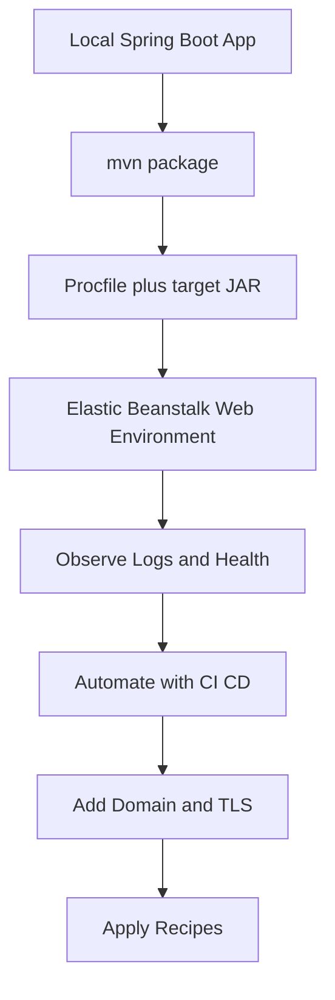

# Java Spring Boot on AWS Elastic Beanstalk

This track covers Spring Boot 3 on AWS Elastic Beanstalk using the Corretto 17 platform branch on 64bit Amazon Linux 2023.
It follows the same progression as the other language tracks: local development, first deployment, configuration, operations, automation, and common AWS integrations.

## Prerequisites

- Java 17 installed locally.
- Apache Maven 3.9 or later.
- AWS CLI v2 configured with credentials and a default region.
- EB CLI installed and available in `PATH`.
- IAM permissions for Elastic Beanstalk, EC2, S3, CloudFormation, CloudWatch, ACM, Route 53, and any optional integration services.

```bash
java --version
mvn --version
aws --version
eb --version
aws sts get-caller-identity
```

## What You'll Build

You will build a Spring Boot application that:

- Packages as a runnable JAR with Maven.
- Binds to `server.port=${PORT:5000}` so it works both locally and on Elastic Beanstalk.
- Starts through a `Procfile` using `java -jar target/guide-0.0.1-SNAPSHOT.jar`.
- Uses environment properties, `.ebextensions`, CloudWatch logging, and AWS integrations.

## Steps

| Step | File | Focus |
|---|---|---|
| 1 | [01-local-run.md](./01-local-run.md) | Local Spring Boot run and JAR packaging |
| 2 | [02-first-deploy.md](./02-first-deploy.md) | First Elastic Beanstalk deployment on Corretto 17 |
| 3 | [03-configuration.md](./03-configuration.md) | Environment properties, `Procfile`, and `.ebextensions` |
| 4 | [04-logging-monitoring.md](./04-logging-monitoring.md) | Logs, CloudWatch, health, and Logback patterns |
| 5 | [05-infrastructure-as-code.md](./05-infrastructure-as-code.md) | CloudFormation definition for a Java EB environment |
| 6 | [06-ci-cd.md](./06-ci-cd.md) | GitHub Actions build and deploy pipeline |
| 7 | [07-custom-domain-ssl.md](./07-custom-domain-ssl.md) | Route 53 and ACM for HTTPS |
| 8 | [java-runtime.md](./java-runtime.md) | Corretto versions, JVM tuning, and startup behavior |
| 9 | [recipes/index.md](./recipes/index.md) | Integration recipes for common workloads |



## Verification

Use these checks before you start the Java track:

```bash
java --version
mvn --version
aws configure list
eb --version
aws elasticbeanstalk list-platform-versions --filters "Type=PlatformName,Operator==,Values=Corretto"
```

Expected outcomes:

- Java 17 is installed locally.
- Maven can resolve and run builds.
- AWS CLI shows configured credentials and region.
- EB CLI returns a version.
- Elastic Beanstalk platform queries succeed in your AWS account context.

## See Also

- [Language Guides Index](../index.md)
- [Platform Overview](../../platform/index.md)
- [How Elastic Beanstalk Works](../../platform/how-elastic-beanstalk-works.md)
- [Java Recipes](./recipes/index.md)

## Sources

- [AWS Elastic Beanstalk Developer Guide](https://docs.aws.amazon.com/elasticbeanstalk/latest/dg/Welcome.html)
- [Deploying Java applications to Elastic Beanstalk](https://docs.aws.amazon.com/elasticbeanstalk/latest/dg/create_deploy_Java.html)
