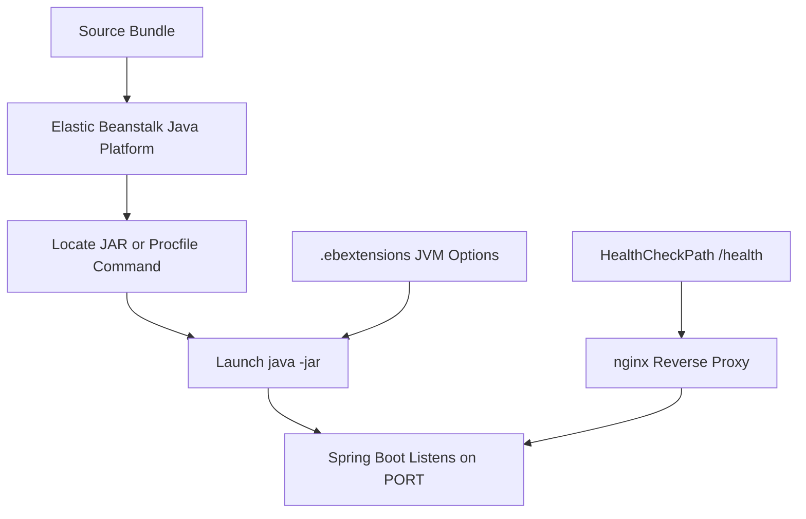

# Java Runtime on Amazon Linux 2023

This reference describes how AWS Elastic Beanstalk runs Java applications on the Corretto platform branch on Amazon Linux 2023.
It focuses on platform selection, JAR discovery, `Procfile` startup, proxy behavior, and JVM tuning.

## Prerequisites

- A Java Elastic Beanstalk environment using Amazon Linux 2023.
- Access to application source including `pom.xml`, `Procfile`, and optional `.ebextensions` files.
- Familiarity with deployment lifecycle and health checks.

## What You'll Build

You will establish a runtime baseline that includes:

- Explicit Corretto platform selection.
- Predictable JAR startup from project root or `target/`.
- JVM options managed by `.ebextensions`.
- Health routing through nginx and Elastic Beanstalk process settings.



## Steps

1. List Java platform versions in your Region.

```bash
aws elasticbeanstalk list-platform-versions --filters "Type=PlatformName,Operator==,Values=Corretto" --region "$REGION"
```

2. Use the recommended platform branch for this guide.

```text
Corretto 17 running on 64bit Amazon Linux 2023
```

3. Keep the packaged JAR in a location the deployment bundle includes.

```text
target/guide-0.0.1-SNAPSHOT.jar
```

4. Use `Procfile` when you want explicit startup behavior.

```text
web: java -jar target/guide-0.0.1-SNAPSHOT.jar
```

5. Bind Spring Boot to the platform-provided port.

```properties
server.port=${PORT:5000}
```

6. Set JVM options with `.ebextensions` when you need memory tuning.

```yaml
option_settings:
    aws:elasticbeanstalk:container:java:jvmoptions:
        Xms: 256m
        Xmx: 512m
        XX: +UseG1GC
```

7. Configure `/health` as the process health check path.

```yaml
option_settings:
    aws:elasticbeanstalk:environment:process:default:
        HealthCheckPath: /health
```

## Platform notes

- Elastic Beanstalk Java on Linux uses Amazon Corretto, not Oracle JDK.
- The load balancer and nginx proxy handle inbound traffic before it reaches Spring Boot.
- If `Procfile` exists, it becomes the clearest way to define the startup command.
- Keep heap settings conservative until you confirm actual memory usage under load.

## Verification

Use these checks to validate runtime assumptions:

```bash
eb status "$ENV_NAME"
eb logs --all
aws elasticbeanstalk describe-configuration-settings --application-name "$APP_NAME" --environment-name "$ENV_NAME" --region "$REGION"
```

Expected outcomes:

- The environment runs a Corretto 17 AL2023 platform.
- Elastic Beanstalk launches the JAR from `Procfile` or platform defaults.
- Spring Boot listens on the value provided in `PORT`.
- JVM options and health path appear in configuration settings.

## See Also

- [Run Locally](./01-local-run.md)
- [Configuration](./03-configuration.md)
- [Custom Platform Hooks](./recipes/custom-platform-hooks.md)

## Sources

- [Deploying Java applications to Elastic Beanstalk](https://docs.aws.amazon.com/elasticbeanstalk/latest/dg/create_deploy_Java.html)
- [Advanced environment customization with configuration files](https://docs.aws.amazon.com/elasticbeanstalk/latest/dg/ebextensions.html)
