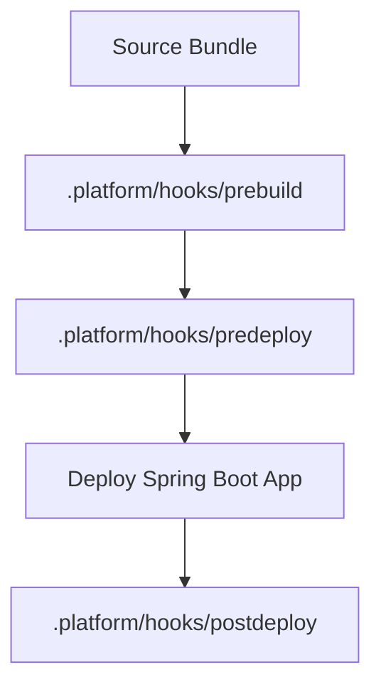

# Customize Java Deployments with Platform Hooks

This recipe explains how to run custom scripts during the Elastic Beanstalk deployment lifecycle using `.platform/hooks/`.
Use platform hooks when you need deterministic operating-system-level changes that do not belong inside the application JAR.

## Prerequisites

- Running Java Elastic Beanstalk environment on Amazon Linux 2023.
- Familiarity with deployment bundles and source-controlled configuration.
- Shell scripting basics for Linux deployment hooks.

## What You'll Build

You will build:

- Prebuild, predeploy, or postdeploy scripts for the Java platform.
- Repeatable customization for directories, permissions, or runtime-side files.
- A safe pattern that keeps application code separate from host configuration logic.



## Steps

1. Create the hook directory structure.

```text
.platform/
└── hooks/
    ├── prebuild/
    ├── predeploy/
    └── postdeploy/
```

2. Add a predeploy script that prepares an application directory.

```bash
#!/bin/bash
set -euo pipefail

mkdir -p /var/app/current/runtime
chown webapp:webapp /var/app/current/runtime
```

3. Add a postdeploy script that records the deployed version.

```bash
#!/bin/bash
set -euo pipefail

date --iso-8601=seconds > /var/app/current/runtime/deployed-at.txt
```

4. Make sure scripts are executable before packaging.

```bash
chmod +x .platform/hooks/predeploy/10-prepare-runtime.sh
chmod +x .platform/hooks/postdeploy/50-record-deploy.sh
```

5. Deploy the updated application bundle.

```bash
eb deploy --staged
```

## Verification

Use these checks after deployment:

```bash
eb logs --all
eb events
```

Expected outcomes:

- Hook scripts run in the expected lifecycle order.
- The deployment succeeds without manual instance changes.
- Files created by the hooks exist on the host after deployment.
- Customization remains in source control with the application bundle.

## See Also

- [Java Runtime](../java-runtime.md)
- [Configuration](../03-configuration.md)
- [Docker Deploy](./docker-deploy.md)

## Sources

- [Extending Elastic Beanstalk Linux platforms](https://docs.aws.amazon.com/elasticbeanstalk/latest/dg/platforms-linux-extend.html)
- [Platform hooks](https://docs.aws.amazon.com/elasticbeanstalk/latest/dg/platforms-linux-extend.hooks.html)
