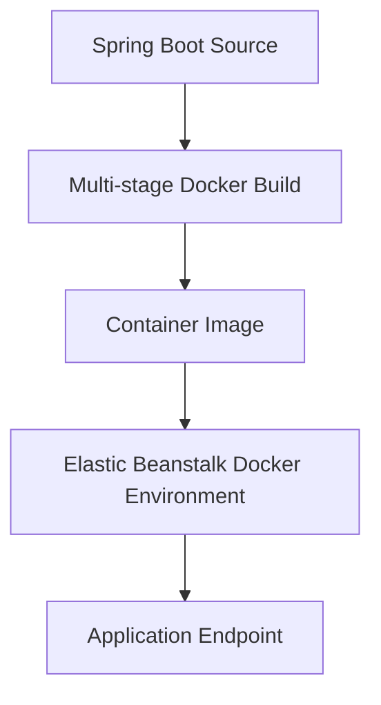

# Deploy Spring Boot with Docker on Elastic Beanstalk

This recipe shows how to package a Spring Boot application into a Docker image for Elastic Beanstalk deployments.
Use this path when you need full control over the runtime image rather than the native Java platform.

## Prerequisites

- Spring Boot application prepared for container packaging.
- Elastic Beanstalk Docker platform target environment.
- Docker installed locally.
- Understanding of `Dockerfile` and Elastic Beanstalk Docker deployment options.

## What You'll Build

You will build a multi-stage Docker image for single-container Elastic Beanstalk deployments.



## Steps

1. Create a multi-stage `Dockerfile` for the application.

```dockerfile
FROM maven:3.9.9-eclipse-temurin-17 AS build
WORKDIR /src
COPY pom.xml .
COPY src src
RUN mvn --batch-mode clean package -DskipTests

FROM amazoncorretto:17-alpine3.20
WORKDIR /app
COPY --from=build /src/target/guide-0.0.1-SNAPSHOT.jar app.jar
ENV PORT=5000
EXPOSE 5000
ENTRYPOINT ["java", "-jar", "/app/app.jar"]
```

2. Build and test the image locally.

```bash
docker build --tag eb-java:latest .
docker run --publish 5000:5000 eb-java:latest
```

3. Initialize or update the Elastic Beanstalk environment on the Docker platform branch.

```bash
eb init
eb create "$ENV_NAME-docker"
```

4. Deploy the containerized application version.

```bash
eb deploy "$ENV_NAME-docker"
```

5. Validate endpoint behavior and logs.

```bash
eb status "$ENV_NAME-docker"
eb logs --all "$ENV_NAME-docker"
```

## Verification

Use these checks after deployment:

```bash
docker build --tag eb-java:latest .
eb status "$ENV_NAME-docker"
curl --verbose "http://$CNAME/health"
```

Expected outcomes:

- The container image builds successfully.
- The app listens on the container port expected by Elastic Beanstalk.
- Elastic Beanstalk deployment succeeds on the Docker platform.
- `/health` returns the expected application response.

## See Also

- [Java Runtime](../java-runtime.md)
- [First Deploy](../02-first-deploy.md)
- [Custom Platform Hooks](./custom-platform-hooks.md)

## Sources

- [Single container Docker environments on Elastic Beanstalk](https://docs.aws.amazon.com/elasticbeanstalk/latest/dg/single-container-docker.html)
