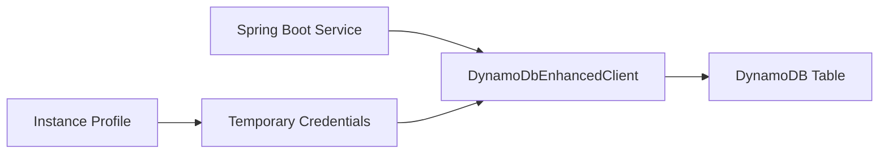

# Use DynamoDB from Spring Boot on Elastic Beanstalk

This recipe shows a Spring Boot-friendly DynamoDB access pattern using the AWS SDK for Java 2.x enhanced client.
It gives you a repository-style model while staying aligned with current AWS Java SDK guidance.

## Prerequisites

- Running Java Elastic Beanstalk environment.
- DynamoDB table already created.
- Instance profile permissions for DynamoDB read and write actions.
- AWS SDK for Java 2.x DynamoDB dependencies.

## What You'll Build

You will build:

- A table name environment property.
- DynamoDB enhanced client configuration.
- A simple repository-style endpoint for put and get operations.



## Steps

1. Set the table name as an environment property.

```bash
eb setenv APP_DYNAMODB_TABLE="guide-items"
```

2. Add AWS SDK dependencies.

```xml
<dependency>
    <groupId>software.amazon.awssdk</groupId>
    <artifactId>dynamodb</artifactId>
</dependency>
<dependency>
    <groupId>software.amazon.awssdk</groupId>
    <artifactId>dynamodb-enhanced</artifactId>
</dependency>
```

3. Create a model and repository configuration.

```java
package com.example.guide.model;

import software.amazon.awssdk.enhanced.dynamodb.mapper.annotations.DynamoDbBean;
import software.amazon.awssdk.enhanced.dynamodb.mapper.annotations.DynamoDbPartitionKey;

@DynamoDbBean
public class GuideItem {
    private String id;
    private String value;

    @DynamoDbPartitionKey
    public String getId() { return id; }
    public void setId(String id) { this.id = id; }
    public String getValue() { return value; }
    public void setValue(String value) { this.value = value; }
}
```

4. Use the enhanced client in a controller.

```java
package com.example.guide.controller;

import java.util.Map;
import org.springframework.beans.factory.annotation.Value;
import org.springframework.web.bind.annotation.GetMapping;
import org.springframework.web.bind.annotation.RestController;
import software.amazon.awssdk.enhanced.dynamodb.DynamoDbEnhancedClient;
import software.amazon.awssdk.enhanced.dynamodb.DynamoDbTable;
import software.amazon.awssdk.enhanced.dynamodb.TableSchema;

@RestController
public class DynamoController {
    private final DynamoDbEnhancedClient enhancedClient;

    @Value("${APP_DYNAMODB_TABLE}")
    private String tableName;

    public DynamoController(DynamoDbEnhancedClient enhancedClient) {
        this.enhancedClient = enhancedClient;
    }

    @GetMapping("/dynamodb-check")
    public Map<String, String> dynamodbCheck() {
        DynamoDbTable<GuideItem> table = enhancedClient.table(tableName, TableSchema.fromBean(GuideItem.class));
        GuideItem item = new GuideItem();
        item.setId("health");
        item.setValue("reachable");
        table.putItem(item);
        return Map.of("dynamodb", table.getItem(r -> r.key(k -> k.partitionValue("health"))).getValue());
    }
}
```

5. Deploy the application.

```bash
eb deploy --staged
```

## Verification

Use these checks after deployment:

```bash
eb printenv
eb logs --all
curl --verbose "http://$CNAME/dynamodb-check"
```

Expected outcomes:

- The application can write and read a DynamoDB item.
- AWS SDK authentication uses the instance profile.
- The table name stays configurable by environment.
- Logs do not show credential-loading failures.

## See Also

- [IAM Instance Profile](./iam-instance-profile.md)
- [S3 Storage](./s3-storage.md)
- [Configuration](../03-configuration.md)

## Sources

- [Use the DynamoDB enhanced client in the AWS SDK for Java 2.x](https://docs.aws.amazon.com/sdk-for-java/latest/developer-guide/ddb-en-client-getting-started-dynamodbTable.html)
- [Programming DynamoDB with Java](https://docs.aws.amazon.com/amazondynamodb/latest/developerguide/ProgrammingWithJava.html)
