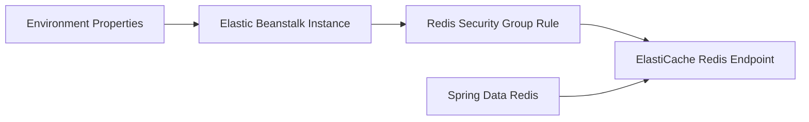

# Integrate Amazon ElastiCache Redis with Spring Boot on Elastic Beanstalk

This recipe shows how to add Redis-backed caching to a Spring Boot application running on Elastic Beanstalk.
Use this pattern when you need lower-latency reads, session offload, or cache-aside behavior inside the same VPC.

## Prerequisites

- Running Java Elastic Beanstalk environment in a VPC.
- Existing Amazon ElastiCache for Redis cluster or serverless cache reachable from the environment.
- Security group rules allowing access to Redis on port `6379`.
- Spring Data Redis dependency.

## What You'll Build

You will build:

- Redis endpoint configuration through environment properties.
- A Spring `RedisTemplate` backed by ElastiCache.
- A cache validation endpoint.



## Steps

1. Set Redis connection properties.

```bash
eb setenv SPRING_DATA_REDIS_HOST="mycache.xxxxxx.use1.cache.amazonaws.com" SPRING_DATA_REDIS_PORT=6379
```

2. Add Spring Data Redis.

```xml
<dependency>
    <groupId>org.springframework.boot</groupId>
    <artifactId>spring-boot-starter-data-redis</artifactId>
</dependency>
```

3. Create a simple cache controller.

```java
package com.example.guide.controller;

import java.util.Map;
import org.springframework.data.redis.core.StringRedisTemplate;
import org.springframework.web.bind.annotation.GetMapping;
import org.springframework.web.bind.annotation.RestController;

@RestController
public class RedisController {
    private final StringRedisTemplate redisTemplate;

    public RedisController(StringRedisTemplate redisTemplate) {
        this.redisTemplate = redisTemplate;
    }

    @GetMapping("/cache-check")
    public Map<String, String> cacheCheck() {
        redisTemplate.opsForValue().set("health", "reachable");
        return Map.of("redis", redisTemplate.opsForValue().get("health"));
    }
}
```

4. Deploy the updated application.

```bash
eb deploy --staged
```

5. Validate VPC placement and security groups if the check fails.

## Verification

Use these checks after deployment:

```bash
eb printenv
eb logs --all
curl --verbose "http://$CNAME/cache-check"
```

Expected outcomes:

- Redis host and port are present in environment properties.
- The Spring Boot app can set and get a Redis value.
- `/cache-check` returns a success payload.
- Network controls allow only intended application-to-cache traffic.

## See Also

- [VPC Networking](../../../platform/networking.md)
- [IAM Instance Profile](./iam-instance-profile.md)
- [Configuration](../03-configuration.md)

## Sources

- [What is Amazon ElastiCache for Redis](https://docs.aws.amazon.com/AmazonElastiCache/latest/dg/WhatIs.html)
- [Using Elastic Beanstalk with Amazon VPC](https://docs.aws.amazon.com/elasticbeanstalk/latest/dg/AWSHowTo-vpc.html)
