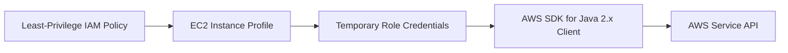

# Use an IAM Instance Profile with Spring Boot on Elastic Beanstalk

This recipe explains how to grant a Spring Boot application access to AWS services through the Elastic Beanstalk EC2 instance profile.
It follows AWS best practice by avoiding static credentials in code, environment variables, deployment bundles, or CI files.

## Prerequisites

- Running Java Elastic Beanstalk environment.
- Ability to update IAM roles and instance profiles.
- A clear list of AWS API actions the app needs.
- One or more AWS SDK for Java 2.x service clients in the application.

## What You'll Build

You will build:

- A least-privilege IAM policy attached to the environment instance profile.
- AWS SDK clients that use temporary credentials automatically.
- A permission model that supports S3, DynamoDB, Secrets Manager, or other AWS services.



## Steps

1. Identify the instance profile attached to the Elastic Beanstalk environment.

```bash
aws elasticbeanstalk describe-configuration-settings --application-name "$APP_NAME" --environment-name "$ENV_NAME" --region "$REGION"
```

2. Create or update a policy with the minimum required actions.

```json
{
  "Version": "2012-10-17",
  "Statement": [
    {
      "Effect": "Allow",
      "Action": [
        "s3:GetObject",
        "s3:PutObject"
      ],
      "Resource": [
        "arn:aws:s3:::my-eb-java-bucket",
        "arn:aws:s3:::my-eb-java-bucket/*"
      ]
    }
  ]
}
```

3. Attach the policy to the role used by the instance profile.

4. Use AWS SDK clients without setting static credentials.

```java
import software.amazon.awssdk.services.s3.S3Client;
import software.amazon.awssdk.services.dynamodb.DynamoDbClient;

S3Client s3Client = S3Client.builder().build();
DynamoDbClient dynamoDbClient = DynamoDbClient.builder().build();
```

5. Redeploy if your application startup depends on new permissions.

```bash
eb deploy --staged
```

## Verification

Use these checks after applying IAM changes:

```bash
aws elasticbeanstalk describe-environment-resources --environment-name "$ENV_NAME" --region "$REGION"
eb logs --all
```

Expected outcomes:

- The environment uses an instance profile with the intended role.
- AWS SDK calls succeed without embedded credentials.
- IAM permissions are scoped to the required actions and resources.
- No access keys appear in code or Elastic Beanstalk environment properties.

## See Also

- [S3 Storage](./s3-storage.md)
- [Secrets Manager](./secrets-manager.md)
- [Best Practices — Security](../../../best-practices/security.md)

## Sources

- [Instance profiles](https://docs.aws.amazon.com/elasticbeanstalk/latest/dg/iam-instanceprofile.html)
- [Default credentials provider chain in the AWS SDK for Java 2.x](https://docs.aws.amazon.com/sdk-for-java/latest/developer-guide/credentials-chain.html)
