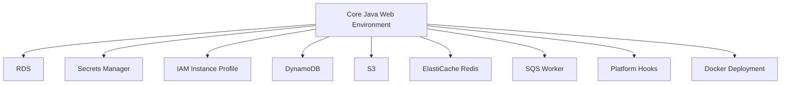

# Java Spring Boot Recipes on Elastic Beanstalk

This recipe collection extends the core Java tutorial track with service integrations and platform customization patterns commonly used with Spring Boot.
Each recipe is designed for incremental adoption so you can layer capabilities onto an existing Elastic Beanstalk environment.

## Prerequisites

- Completed the core Java track through first deployment and configuration basics.
- Familiarity with environment properties, `Procfile`, and `.ebextensions` files.
- IAM permissions for the AWS services used in each recipe.

## What You'll Build

You will build optional capabilities around a Spring Boot application:

- Relational database connectivity with Amazon RDS.
- Redis-backed caching with Amazon ElastiCache.
- S3 object storage using AWS SDK for Java 2.x.
- Runtime secret retrieval with AWS Secrets Manager.
- Instance profile-based authentication for AWS SDK clients.
- DynamoDB access patterns for key-value data.
- Worker-tier queue processing with Amazon SQS.
- Container deployment using the Elastic Beanstalk Docker platform.
- Linux platform hook customization during deployment.

## Steps

Choose recipes in this order if you want low-to-high operational complexity:

| Order | Recipe | Primary Service | Outcome |
|---|---|---|---|
| 1 | [rds-integration.md](./rds-integration.md) | Amazon RDS | Externalized relational data |
| 2 | [secrets-manager.md](./secrets-manager.md) | AWS Secrets Manager | Runtime secret retrieval |
| 3 | [iam-instance-profile.md](./iam-instance-profile.md) | IAM | Role-based AWS access |
| 4 | [dynamodb.md](./dynamodb.md) | Amazon DynamoDB | Managed key-value storage |
| 5 | [s3-storage.md](./s3-storage.md) | Amazon S3 | Durable object storage |
| 6 | [elasticache-redis.md](./elasticache-redis.md) | Amazon ElastiCache | Low-latency cache layer |
| 7 | [sqs-worker.md](./sqs-worker.md) | Amazon SQS | Queue-driven async processing |
| 8 | [custom-platform-hooks.md](./custom-platform-hooks.md) | Platform hooks | Deployment lifecycle extensions |
| 9 | [docker-deploy.md](./docker-deploy.md) | Docker | Containerized Java deployment |



## Verification

Before starting any recipe, run baseline checks:

```bash
eb status "$ENV_NAME"
eb printenv
eb logs --all
```

Recipe completion checks should include:

- Service-specific connectivity validation.
- Environment health and recent events review.
- Configuration committed to source control where possible.
- No unmasked account IDs or embedded secrets in examples or logs.

## See Also

- [Java Guide Index](../index.md)
- [Java Runtime](../java-runtime.md)
- [Operations Overview](../../../operations/index.md)

## Sources

- [AWS Elastic Beanstalk Developer Guide](https://docs.aws.amazon.com/elasticbeanstalk/latest/dg/Welcome.html)
