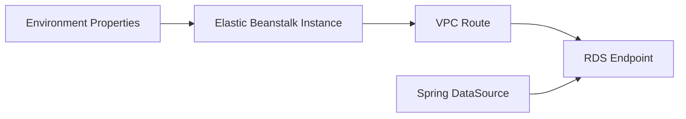

# Integrate Amazon RDS with Spring Boot on Elastic Beanstalk

This recipe shows how to connect a Spring Boot application on Elastic Beanstalk to Amazon RDS.
It keeps the database lifecycle separate from environment replacement so application redeployments do not control primary data persistence.

## Prerequisites

- Running Java Elastic Beanstalk environment.
- Existing Amazon RDS PostgreSQL or MySQL instance.
- Security group rules that allow the application instances to reach the database port.
- Spring Boot JDBC or JPA dependencies for the database engine.

## What You'll Build

You will build:

- Environment properties for database connection settings.
- Spring Boot datasource configuration.
- A lightweight connectivity endpoint.



## Steps

1. Set database connection environment properties.

```bash
eb setenv SPRING_DATASOURCE_URL="jdbc:postgresql://mydb.xxxxx.ap-northeast-2.rds.amazonaws.com:5432/appdb" SPRING_DATASOURCE_USERNAME="appuser" SPRING_DATASOURCE_PASSWORD="<db-password>" SPRING_JPA_HIBERNATE_DDL_AUTO=none
```

2. Add the required dependencies.

```xml
<dependency>
    <groupId>org.springframework.boot</groupId>
    <artifactId>spring-boot-starter-data-jpa</artifactId>
</dependency>
<dependency>
    <groupId>org.postgresql</groupId>
    <artifactId>postgresql</artifactId>
</dependency>
```

3. Add datasource configuration.

```properties
spring.datasource.url=${SPRING_DATASOURCE_URL}
spring.datasource.username=${SPRING_DATASOURCE_USERNAME}
spring.datasource.password=${SPRING_DATASOURCE_PASSWORD}
spring.datasource.hikari.maximum-pool-size=5
```

4. Add a connectivity endpoint.

```java
package com.example.guide.controller;

import java.sql.Connection;
import java.util.Map;
import javax.sql.DataSource;
import org.springframework.web.bind.annotation.GetMapping;
import org.springframework.web.bind.annotation.RestController;

@RestController
public class DbController {
    private final DataSource dataSource;

    public DbController(DataSource dataSource) {
        this.dataSource = dataSource;
    }

    @GetMapping("/db-check")
    public Map<String, String> dbCheck() throws Exception {
        try (Connection connection = dataSource.getConnection()) {
            return Map.of("database", connection.isValid(2) ? "reachable" : "unreachable");
        }
    }
}
```

5. Deploy the updated application.

```bash
eb deploy --staged
```

6. Validate security groups, subnet placement, and route reachability if the check fails.

## Verification

Run these checks after deployment:

```bash
eb printenv
eb logs --all
curl --verbose "http://$CNAME/db-check"
```

Expected outcomes:

- Environment variables are present.
- The application can open a database connection.
- `/db-check` returns a success payload.
- The database lifecycle remains independent from Elastic Beanstalk environment replacement.

## See Also

- [Configuration](../03-configuration.md)
- [Secrets Manager](./secrets-manager.md)
- [IAM Instance Profile](./iam-instance-profile.md)

## Sources

- [Using Elastic Beanstalk with Amazon RDS](https://docs.aws.amazon.com/elasticbeanstalk/latest/dg/AWSHowTo.RDS.html)
- [Using Amazon RDS with Java applications](https://docs.aws.amazon.com/AmazonRDS/latest/UserGuide/CHAP_GettingStarted.CreatingConnecting.Java.html)
