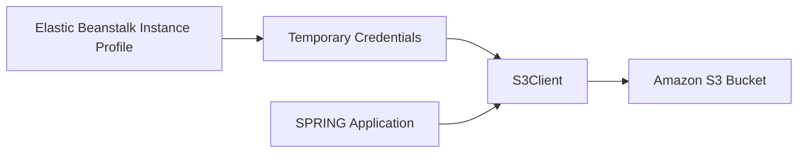

# Use Amazon S3 from Spring Boot on Elastic Beanstalk

This recipe shows how to upload and download files from Amazon S3 using AWS SDK for Java 2.x.
The preferred pattern is instance-profile authentication so the application does not ship static credentials.

## Prerequisites

- Running Java Elastic Beanstalk environment.
- S3 bucket already created.
- Instance profile permissions for `s3:GetObject`, `s3:PutObject`, and related actions.
- AWS SDK for Java 2.x dependency.

## What You'll Build

You will build:

- Bucket-name configuration through environment properties.
- An `S3Client` bean using default credential resolution.
- Upload and download endpoints.



## Steps

1. Set the bucket name as an environment property.

```bash
eb setenv APP_BUCKET_NAME="my-eb-java-bucket"
```

2. Add the AWS SDK dependency.

```xml
<dependency>
    <groupId>software.amazon.awssdk</groupId>
    <artifactId>s3</artifactId>
</dependency>
```

3. Create an S3 configuration bean.

```java
package com.example.guide.config;

import org.springframework.context.annotation.Bean;
import org.springframework.context.annotation.Configuration;
import software.amazon.awssdk.services.s3.S3Client;

@Configuration
public class S3Config {
    @Bean
    public S3Client s3Client() {
        return S3Client.builder().build();
    }
}
```

4. Add a simple upload and read controller.

```java
package com.example.guide.controller;

import java.nio.charset.StandardCharsets;
import java.util.Map;
import org.springframework.beans.factory.annotation.Value;
import org.springframework.web.bind.annotation.GetMapping;
import org.springframework.web.bind.annotation.RestController;
import software.amazon.awssdk.core.sync.RequestBody;
import software.amazon.awssdk.services.s3.S3Client;
import software.amazon.awssdk.services.s3.model.GetObjectRequest;
import software.amazon.awssdk.services.s3.model.PutObjectRequest;

@RestController
public class S3Controller {
    private final S3Client s3Client;

    @Value("${APP_BUCKET_NAME}")
    private String bucketName;

    public S3Controller(S3Client s3Client) {
        this.s3Client = s3Client;
    }

    @GetMapping("/s3-check")
    public Map<String, String> s3Check() {
        s3Client.putObject(
                PutObjectRequest.builder().bucket(bucketName).key("health.txt").build(),
                RequestBody.fromString("reachable", StandardCharsets.UTF_8)
        );
        String content = s3Client.getObjectAsBytes(
                GetObjectRequest.builder().bucket(bucketName).key("health.txt").build()
        ).asUtf8String();
        return Map.of("s3", content);
    }
}
```

5. Deploy the application.

```bash
eb deploy --staged
```

## Verification

Use these checks after deployment:

```bash
eb printenv
eb logs --all
curl --verbose "http://$CNAME/s3-check"
aws s3 ls "s3://my-eb-java-bucket/health.txt" --region "$REGION"
```

Expected outcomes:

- The application writes and reads an object successfully.
- S3 access works without embedded access keys.
- The bucket name is configurable through environment properties.
- Logs show normal SDK requests without credential errors.

## See Also

- [IAM Instance Profile](./iam-instance-profile.md)
- [Secrets Manager](./secrets-manager.md)
- [Configuration](../03-configuration.md)

## Sources

- [Get started with the AWS SDK for Java 2.x](https://docs.aws.amazon.com/sdk-for-java/latest/developer-guide/get-started.html)
- [Amazon S3 examples using SDK for Java 2.x](https://docs.aws.amazon.com/sdk-for-java/latest/developer-guide/java_s3_code_examples.html)
