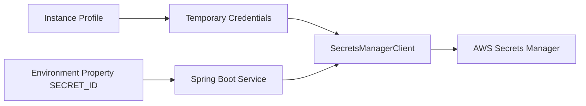

# Retrieve Secrets Manager Values from Spring Boot on Elastic Beanstalk

This recipe shows how to retrieve application secrets from AWS Secrets Manager at runtime.
It avoids embedding passwords, tokens, or connection strings in source code or Elastic Beanstalk environment properties.

## Prerequisites

- Running Java Elastic Beanstalk environment.
- Secret already stored in AWS Secrets Manager.
- Instance profile permissions for `secretsmanager:GetSecretValue`.
- AWS SDK for Java 2.x dependency.

## What You'll Build

You will build:

- A secret identifier stored in an environment property.
- A Secrets Manager client using default credential resolution.
- A small service that reads the secret at runtime.



## Steps

1. Set the secret identifier as an environment property.

```bash
eb setenv APP_SECRET_ID="prod/app/database"
```

2. Add the AWS SDK dependency.

```xml
<dependency>
    <groupId>software.amazon.awssdk</groupId>
    <artifactId>secretsmanager</artifactId>
</dependency>
```

3. Create a simple secret reader service.

```java
package com.example.guide.service;

import org.springframework.beans.factory.annotation.Value;
import org.springframework.stereotype.Service;
import software.amazon.awssdk.services.secretsmanager.SecretsManagerClient;
import software.amazon.awssdk.services.secretsmanager.model.GetSecretValueRequest;

@Service
public class SecretService {
    private final SecretsManagerClient client;

    @Value("${APP_SECRET_ID}")
    private String secretId;

    public SecretService(SecretsManagerClient client) {
        this.client = client;
    }

    public String loadSecret() {
        return client.getSecretValue(GetSecretValueRequest.builder().secretId(secretId).build()).secretString();
    }
}
```

4. Add a safe validation endpoint that confirms retrieval without returning secret contents.

```java
@GetMapping("/secret-check")
public Map<String, String> secretCheck() {
    String secret = secretService.loadSecret();
    return Map.of("secret", secret == null || secret.isBlank() ? "missing" : "loaded");
}
```

5. Deploy the updated application.

```bash
eb deploy --staged
```

## Verification

Use these checks after deployment:

```bash
eb printenv
eb logs --all
curl --verbose "http://$CNAME/secret-check"
```

Expected outcomes:

- The application can retrieve the secret at runtime.
- Secret values are not stored in source control or CLI examples.
- Instance profile permissions are sufficient.
- `/secret-check` confirms access without leaking the secret body.

## See Also

- [IAM Instance Profile](./iam-instance-profile.md)
- [RDS Integration](./rds-integration.md)
- [S3 Storage](./s3-storage.md)

## Sources

- [Get a Secrets Manager secret value using the AWS SDK for Java 2.x](https://docs.aws.amazon.com/secretsmanager/latest/userguide/retrieving-secrets-java-sdk.html)
- [AWS Secrets Manager User Guide](https://docs.aws.amazon.com/secretsmanager/latest/userguide/intro.html)
