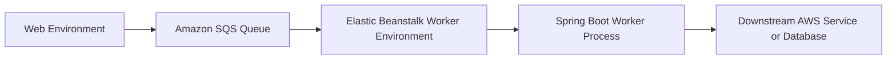

# Process Amazon SQS Messages with an Elastic Beanstalk Worker Environment

This recipe shows how to run asynchronous processing with Elastic Beanstalk worker environments backed by Amazon SQS.
Use this pattern when web requests should hand off slower work such as image processing, notifications, or report generation.

## Prerequisites

- Existing Elastic Beanstalk application.
- Amazon SQS queue for worker messages.
- IAM permissions for SQS and worker environment creation.
- A Java worker application that can poll or receive work from the queue.

## What You'll Build

You will build:

- A worker-tier Elastic Beanstalk environment.
- Queue settings that connect the worker to Amazon SQS.
- A simple Spring Boot message processor.



## Steps

1. Create the SQS queue if you do not already have one.

```bash
aws sqs create-queue --queue-name "$APP_NAME-worker" --region "$REGION"
```

2. Initialize a worker environment.

```bash
eb create "$ENV_NAME-worker" --tier worker
```

3. Configure the worker queue URL and polling behavior.

```yaml
option_settings:
    aws:elasticbeanstalk:sqsd:
        HttpPath: /worker/process
        MimeType: application/json
        WorkerQueueURL: https://sqs.$REGION.amazonaws.com/<account-id>/$APP_NAME-worker
```

4. Add a Spring Boot endpoint to receive work from the daemon.

```java
package com.example.guide.controller;

import java.util.Map;
import org.springframework.http.ResponseEntity;
import org.springframework.web.bind.annotation.PostMapping;
import org.springframework.web.bind.annotation.RequestBody;
import org.springframework.web.bind.annotation.RestController;

@RestController
public class WorkerController {
    @PostMapping("/worker/process")
    public ResponseEntity<Map<String, String>> process(@RequestBody String body) {
        return ResponseEntity.ok(Map.of("status", "processed", "payload", body));
    }
}
```

5. Send a test message.

```bash
aws sqs send-message --queue-url "https://sqs.$REGION.amazonaws.com/<account-id>/$APP_NAME-worker" --message-body '{"job":"health-check"}' --region "$REGION"
```

6. Check worker logs and events.

```bash
eb logs "$ENV_NAME-worker"
eb events "$ENV_NAME-worker"
```

## Verification

Use these checks after deployment:

```bash
eb status "$ENV_NAME-worker"
eb logs --all "$ENV_NAME-worker"
aws sqs get-queue-attributes --queue-url "https://sqs.$REGION.amazonaws.com/<account-id>/$APP_NAME-worker" --attribute-names ApproximateNumberOfMessages ApproximateNumberOfMessagesNotVisible --region "$REGION"
```

Expected outcomes:

- The worker environment reaches `Ready` state.
- Messages are delivered from SQS to the worker HTTP endpoint.
- Worker logs confirm successful processing.
- Queue depth returns toward zero after processing.

## See Also

- [CI/CD](../06-ci-cd.md)
- [IAM Instance Profile](./iam-instance-profile.md)
- [How Elastic Beanstalk Works](../../../platform/how-elastic-beanstalk-works.md)

## Sources

- [Worker environments](https://docs.aws.amazon.com/elasticbeanstalk/latest/dg/using-features-managing-env-tiers.html)
- [Amazon SQS examples using SDK and AWS CLI](https://docs.aws.amazon.com/AWSSimpleQueueService/latest/SQSDeveloperGuide/sqs-working-with-queues.html)
