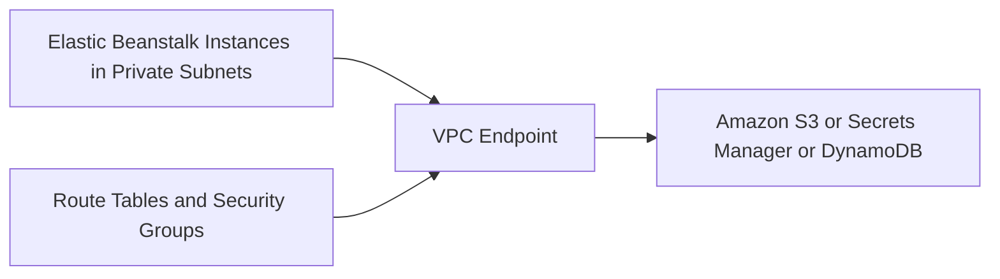

# Use VPC Endpoints for Java Workloads on Elastic Beanstalk

This tutorial shows how to keep traffic to selected AWS services inside your VPC by using VPC endpoints with Elastic Beanstalk.
It is most useful for private environments that access S3, DynamoDB, or Secrets Manager.

## Prerequisites

- Elastic Beanstalk environment deployed into a VPC.
- Familiarity with route tables and security groups.
- Target AWS services identified for private connectivity.

## What You'll Build

You will build:

- Gateway or interface endpoints for required AWS services.
- Security controls that allow private service access.
- Spring Boot integrations that continue using normal AWS SDK endpoints.

## Steps

1. Create the required VPC endpoint.

```bash
aws ec2 create-vpc-endpoint --vpc-id "$VPC_ID" --service-name "com.amazonaws.$REGION.s3" --vpc-endpoint-type Gateway --route-table-ids "rtb-xxxxxxxx" --region "$REGION"
```

2. For interface endpoints, attach security groups that allow HTTPS from the application subnets.

```text
Application subnets -> HTTPS 443 -> Interface endpoint ENIs
```

3. Keep your Java SDK code unchanged unless you require explicit endpoint overrides.

```java
S3Client.builder().region(Region.of(System.getenv("AWS_REGION"))).build();
```

4. Verify that route tables or DNS resolution direct traffic to the endpoint.

```bash
aws ec2 describe-vpc-endpoints --filters "Name=vpc-id,Values=$VPC_ID" --region "$REGION"
```

5. Redeploy or restart the environment if you also update security groups or network settings.

```bash
eb deploy "$ENV_NAME" --staged
```



## Verification

Run these checks after the network update:

```bash
aws ec2 describe-vpc-endpoints --filters "Name=vpc-id,Values=$VPC_ID" --region "$REGION"
eb logs --all
```

Expected outcomes:

- Required VPC endpoints exist and are in the `available` state.
- Application traffic to supported AWS services stays inside the VPC path.
- Logs do not show public egress dependency for those services.

## See Also

- [ElastiCache Redis Recipe](./elasticache-redis.md)
- [Secrets Manager Recipe](./secrets-manager.md)
- [Platform Networking](../../../platform/networking.md)

## Sources

- [Using Elastic Beanstalk with Amazon VPC](https://docs.aws.amazon.com/elasticbeanstalk/latest/dg/using-features.managing.vpc.html)
- [Access AWS services through VPC endpoints](https://docs.aws.amazon.com/vpc/latest/privatelink/gateway-endpoints.html)
