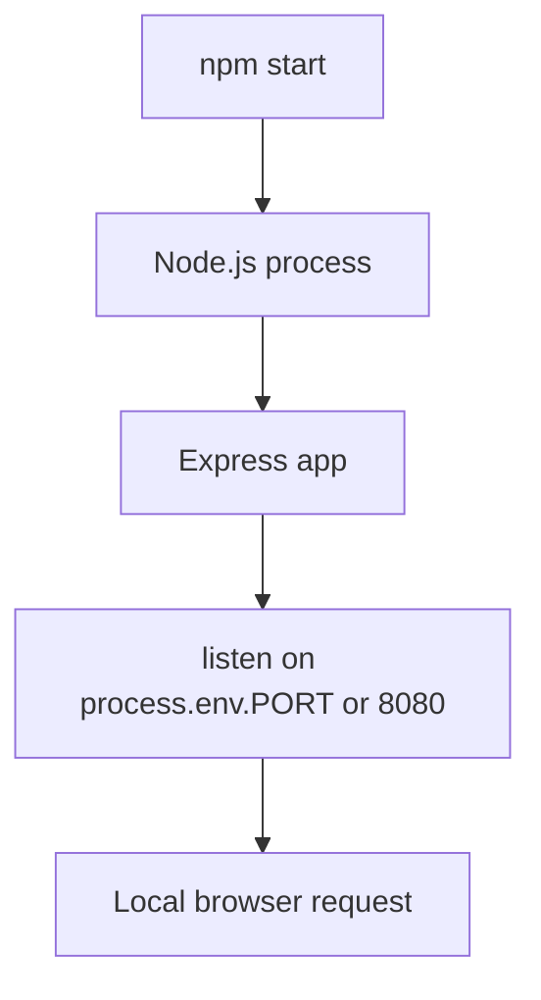

# Run Express Locally for Elastic Beanstalk

## Prerequisites

- Node.js 18 or later installed.
- A terminal in your project folder.
- npm registry access for installing dependencies.
- Basic familiarity with JavaScript modules and Express.

## What You'll Build

You will create a minimal Express app that listens on `process.env.PORT` with a default of `8080`, define a start command, and declare a Node engine version in `package.json` so the app aligns with Elastic Beanstalk Node.js expectations.



## Steps

1. Initialize a new npm project and install Express.

    ```bash
    npm init --yes
    npm install express
    ```

2. Create `app.js` with an Elastic Beanstalk-compatible port pattern.

    ```javascript
    const express = require("express");

    const app = express();
    const port = process.env.PORT || 8080;

    app.get("/", (req, res) => {
        res.send("Hello from Elastic Beanstalk Node.js");
    });

    app.listen(port, () => {
        console.log(`Server listening on ${port}`);
    });
    ```

3. Update `package.json` scripts and engine constraints.

    ```json
    {
        "name": "eb-nodejs-app",
        "version": "1.0.0",
        "private": true,
        "main": "app.js",
        "scripts": {
            "start": "node app.js"
        },
        "engines": {
            "node": ">=18"
        },
        "dependencies": {
            "express": "^4.19.2"
        }
    }
    ```

4. Run the application locally.

    ```bash
    npm start
    ```

5. Test with a local request.

    ```bash
    curl --verbose http://127.0.0.1:8080/
    ```

## Verification

- Terminal shows `Server listening on 8080` or another value from `PORT`.
- HTTP request returns a `200` response and the example message body.
- `package.json` contains both `scripts.start` and `engines.node`.
- Source tree is ready for Elastic Beanstalk source bundle packaging.

## See Also

- [First Deployment Concepts](./02-first-deploy.md)
- [Node.js Runtime on Elastic Beanstalk](./nodejs-runtime.md)
- [How Elastic Beanstalk Works](../../platform/how-elastic-beanstalk-works.md)

## Sources

- [Node.js and Express walkthrough for Elastic Beanstalk](https://docs.aws.amazon.com/elasticbeanstalk/latest/dg/create_deploy_nodejs_express.html)
