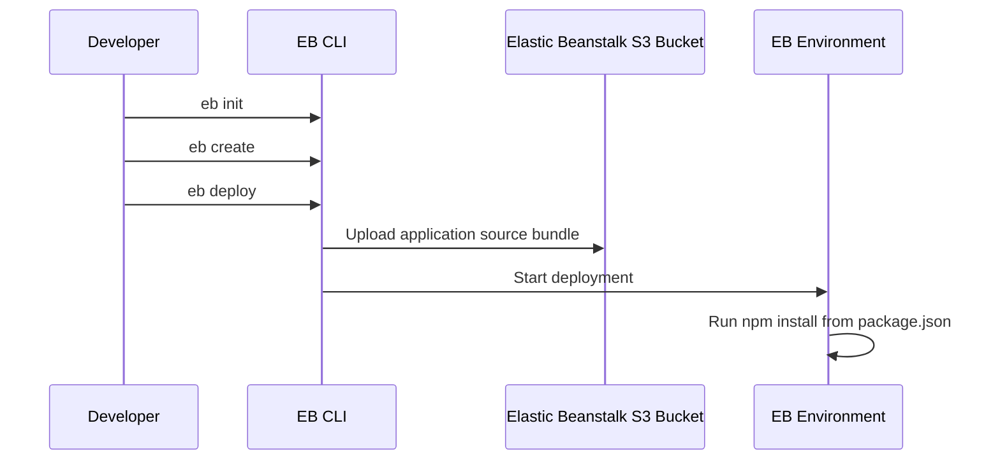

# First Node.js Deployment to Elastic Beanstalk

## Prerequisites

- Completed local Express setup from `01-local-run.md`.
- EB CLI authenticated through configured AWS CLI profile.
- An application folder containing `app.js`, `package.json`, and dependencies.
- IAM permissions to create Elastic Beanstalk applications and environments.

## What You'll Build

You will initialize an Elastic Beanstalk application, create an environment with a Node.js platform branch, and deploy application versions from your local source bundle. You will also understand where dependency installation happens during deployment.



## Steps

1. Initialize Elastic Beanstalk metadata in your project.

    ```bash
    eb init
    ```

    During prompts, select:

    - Region for your deployment.
    - Existing or new Elastic Beanstalk application name.
    - Node.js platform running on 64bit Amazon Linux 2023.

2. Create a web server environment.

    ```bash
    eb create <env-name>
    ```

3. Deploy your current source bundle revision.

    ```bash
    eb deploy
    ```

4. Open the environment endpoint generated by Elastic Beanstalk.

    ```bash
    eb open
    ```

5. Inspect deployment events and health.

    ```bash
    eb events
    eb health
    ```

## Verification

- `eb status` returns `Ready` and `Green` health.
- Environment URL responds with your Express root route.
- Event stream indicates successful application version deployment.
- Deployment flow includes dependency installation from `package.json`.

## See Also

- [Local Express Setup](./01-local-run.md)
- [Configuration and Customization](./03-configuration.md)
- [How Elastic Beanstalk Works](../../platform/how-elastic-beanstalk-works.md)

## Sources

- [Deploying Node.js applications to Elastic Beanstalk](https://docs.aws.amazon.com/elasticbeanstalk/latest/dg/create_deploy_nodejs.html)
