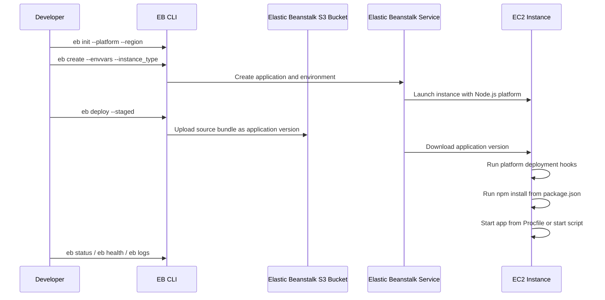

# First Node.js Deployment to Elastic Beanstalk

This tutorial turns a local Express app into its first Elastic Beanstalk environment using explicit EB CLI commands, repeatable configuration, and basic deployment verification.

## Prerequisites

- Completed local Express setup from `01-local-run.md`.
- AWS CLI and EB CLI installed on your workstation.
- EB CLI authenticated through a configured AWS CLI profile.
- An application folder containing `app.js` or `server.js`, `package.json`, and dependencies.
- IAM permissions to create Elastic Beanstalk applications, environments, Auto Scaling resources, security groups, and load balancers.

## What You'll Build

You will create:

- An Elastic Beanstalk application initialized for the Node.js platform.
- A first web environment using a single instance or an Application Load Balancer pattern.
- A deployment workflow that packages source, uploads an application version, installs dependencies, and starts your Express process.
- A baseline verification routine using status, health, events, and logs.



## Steps

1. Set deployment variables and confirm your project has a start command.

    ```bash
    export APP_NAME="eb-nodejs-guide"
    export ENV_NAME="eb-nodejs-guide-dev"
    export REGION="ap-northeast-2"
    ```

    Your `package.json` should include a start script that launches the web process:

    ```json
    {
      "name": "eb-nodejs-guide",
      "version": "1.0.0",
      "scripts": {
        "start": "node app.js"
      }
    }
    ```

    !!! tip
        Elastic Beanstalk detects a Node.js app from `package.json`. If both a `Procfile` and `npm start` are present, the `Procfile` gives you the most explicit control over the startup command.

2. Initialize Elastic Beanstalk metadata with explicit platform and region settings.

    ```bash
    eb init "$APP_NAME" --platform "Node.js 22 running on 64bit Amazon Linux 2023" --region "$REGION"
    ```

    This command creates local project metadata under `.elasticbeanstalk/` and associates the working directory with your Elastic Beanstalk application.

3. Define the process start command explicitly.

    Use one of these patterns:

    - `Procfile` for process-level control.
    - `.ebextensions` for environment-level option settings.

    Example `Procfile`:

    ```text
    web: node app.js
    ```

    Example `.ebextensions/nodecommand.config`:

    ```yaml
    option_settings:
      aws:elasticbeanstalk:container:nodejs:
        NodeCommand: "node app.js"
    ```

    Use one method consistently. For modern Node.js platform branches, `Procfile` is the clearer and more portable choice.

4. Make sure your application binds to the port provided by Elastic Beanstalk.

    A minimal Express listener should use `process.env.PORT`:

    ```javascript
    const express = require("express");
    const app = express();
    const port = process.env.PORT || 8080;

    app.get("/", (req, res) => {
      res.send("Elastic Beanstalk Node.js app is running");
    });

    app.listen(port, () => {
      console.log(`Listening on ${port}`);
    });
    ```

    Elastic Beanstalk routes traffic to the port expected by the platform proxy layer. Hard-coding another port is a common first-deploy mistake.

5. Create the first environment with explicit sizing and environment variables.

    Single-instance example for low-cost first validation:

    ```bash
    eb create "$ENV_NAME" --single --instance_type "t3.small" --envvars "NODE_ENV=production,PORT=8080"
    ```

    Application Load Balancer example for a more production-like baseline:

    ```bash
    eb create "$ENV_NAME" --elb-type application --instance_type "t3.small" --envvars "NODE_ENV=production,PORT=8080"
    ```

    During environment creation, Elastic Beanstalk provisions infrastructure, installs the selected Node.js platform branch, configures the reverse proxy, and prepares your source bundle deployment target.

    !!! warning
        `--single` is useful for a first tutorial deployment, but it is not highly available. For production, prefer a load-balanced environment and then layer in capacity, health reporting, secrets management, and deployment policies.

6. Understand what happens during deployment.

    When you run `eb create` or `eb deploy`, the platform generally performs this sequence:

    1. Bundle your application source into an application version.
    2. Upload the bundle to the Elastic Beanstalk S3 bucket.
    3. Download the application version to the instance.
    4. Run platform deployment hooks.
    5. Run `npm install` based on `package.json`.
    6. Start the Node.js application using the detected start command or `Procfile`.

    This is why `package.json`, the lock file if you use one, and the startup command must all be correct before the first deploy.

7. Deploy updated local changes explicitly.

    ```bash
    eb deploy "$ENV_NAME"
    ```

    If you want to include modified files that are not committed to Git, use:

    ```bash
    eb deploy "$ENV_NAME" --staged
    ```

    `--staged` is especially useful when testing a startup fix before creating a commit.

8. Inspect status, health, events, and application logs.

    ```bash
    eb status "$ENV_NAME"
    eb health "$ENV_NAME"
    eb events "$ENV_NAME"
    eb logs "$ENV_NAME"
    ```

    Use these commands for different questions:

    - `eb status` confirms current state, URL, and deployed version label.
    - `eb health` shows instance and environment health signals.
    - `eb events` shows the deployment timeline from environment creation through application startup.
    - `eb logs` retrieves logs for startup failures, dependency installation errors, and proxy or application exceptions.

9. Open the environment URL and validate the running application.

    ```bash
    eb open "$ENV_NAME"
    ```

    You should see your Express root route respond successfully after health turns green.

### Common First-Deploy Failures

#### Wrong Node.js version

Symptoms:

- `npm install` fails because dependencies require a newer runtime.
- Application startup logs show syntax or engine compatibility errors.

Checks and fixes:

- Confirm the platform branch used in `eb init --platform` matches your application runtime expectations.
- Align `package.json` engines with the platform you actually deploy.
- Redeploy after re-running `eb init` with the intended platform branch if needed.

#### Missing start script or incorrect startup command

Symptoms:

- Environment creates successfully but the app never becomes healthy.
- Logs show that the platform could not determine how to start the Node.js process.

Checks and fixes:

- Ensure `package.json` contains `"start": "node app.js"` or equivalent.
- If you use `Procfile`, verify the command references the correct entrypoint filename.
- If you use `.ebextensions/nodecommand.config`, confirm the `NodeCommand` value matches the actual app file.

#### Port binding issues

Symptoms:

- Health remains degraded even though the process starts.
- Proxy or health check requests fail with connection refused errors.

Checks and fixes:

- Make sure the app listens on `process.env.PORT`.
- Do not hard-code port `3000` unless you deliberately align the platform and proxy expectations.
- Review `eb logs "$ENV_NAME"` for listener, proxy, or application startup messages.

## Verification

Run a basic first-deploy verification set:

```bash
eb status "$ENV_NAME"
eb health "$ENV_NAME"
eb events "$ENV_NAME"
eb logs "$ENV_NAME"
```

Expected checks:

- `eb status` shows the environment in `Ready` state.
- `eb health` reports `Green` after startup completes.
- `eb events` shows successful environment creation and application version deployment.
- `eb logs` does not show a crash loop, missing module error, or failed startup command.
- The environment URL responds with your Express route content.

If verification fails, fix the startup command, runtime version, or port binding first before changing infrastructure settings.

## See Also

- [Local Express Setup](./01-local-run.md)
- [Configuration and Customization](./03-configuration.md)
- [How Elastic Beanstalk Works](../../platform/how-elastic-beanstalk-works.md)

## Sources

- [Deploying Node.js applications to Elastic Beanstalk](https://docs.aws.amazon.com/elasticbeanstalk/latest/dg/create_deploy_nodejs.html)
- [Elastic Beanstalk Node.js platform guide](https://docs.aws.amazon.com/elasticbeanstalk/latest/dg/nodejs-platform.html)
- [EB CLI command reference](https://docs.aws.amazon.com/elasticbeanstalk/latest/dg/eb3-cmd-commands.html)
- [Using the Elastic Beanstalk health command](https://docs.aws.amazon.com/elasticbeanstalk/latest/dg/eb3-cmd-commands-health.html)
- [Viewing Elastic Beanstalk environment events](https://docs.aws.amazon.com/elasticbeanstalk/latest/dg/eb3-cmd-commands-events.html)
- [Requesting Elastic Beanstalk logs](https://docs.aws.amazon.com/elasticbeanstalk/latest/dg/eb3-cmd-commands-logs.html)
