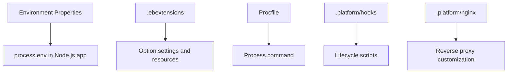

# Configure Node.js Environments on Elastic Beanstalk

## Prerequisites

- A deployed Node.js Elastic Beanstalk environment.
- Project repository initialized with `.elasticbeanstalk/` metadata.
- Understanding of environment property usage from application code.
- Permission to update environment configuration and deploy new versions.

## What You'll Build

You will configure runtime values with environment properties, extend environment behavior with `.ebextensions`, direct process startup with `Procfile`, run platform hooks, and customize nginx behavior under `.platform/nginx`.



## Steps

1. Add environment properties in Elastic Beanstalk console or CLI and read them in application code.

    ```javascript
    const envName = process.env.ENV_NAME || "dev";
    const logLevel = process.env.LOG_LEVEL || "info";
    ```

2. Add `.ebextensions` option settings for repeatable configuration.

    ```yaml
    option_settings:
      aws:elasticbeanstalk:application:environment:
        ENV_NAME: prod
        LOG_LEVEL: info
      aws:elasticbeanstalk:container:nodejs:
        NodeCommand: "npm start"
    ```

3. Define a `Procfile` when you need explicit process command control.

    ```text
    web: npm start
    ```

4. Add platform hooks for deployment lifecycle customization.

    ```text
    .platform/hooks/prebuild/10-validate.sh
    .platform/hooks/predeploy/20-migrate.sh
    .platform/hooks/postdeploy/30-smoke-test.sh
    ```

5. Add nginx custom snippets if you need reverse proxy customization.

    ```text
    .platform/nginx/conf.d/security-headers.conf
    .platform/nginx/conf.d/compression.conf
    ```

6. Redeploy and verify applied settings.

    ```bash
    eb deploy
    eb config
    ```

## Verification

- Application can read configured keys through `process.env`.
- Environment option settings from `.ebextensions` are visible in effective configuration.
- `Procfile` command is used as expected for the web process.
- Hook scripts execute in lifecycle order without deployment failure.
- nginx custom fragments load successfully and do not break health checks.

## See Also

- [First Deployment](./02-first-deploy.md)
- [Node.js Runtime Reference](./nodejs-runtime.md)
- [Custom Platform Hooks Recipe](./recipes/custom-platform-hooks.md)

## Sources

- [Node.js platform on Amazon Linux 2 and Amazon Linux 2023](https://docs.aws.amazon.com/elasticbeanstalk/latest/dg/nodejs-platform-al2.html)
