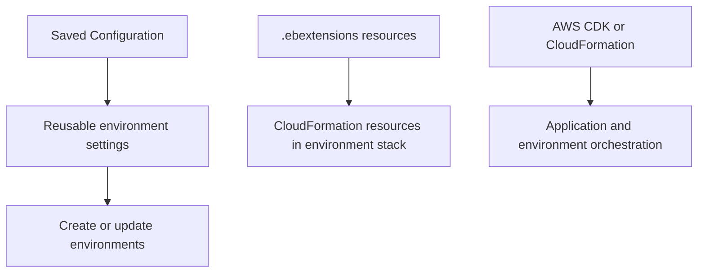

---
hide:
  - toc
---

# Infrastructure as Code for Node.js Environments

## Prerequisites

- Existing Elastic Beanstalk Node.js application and environment.
- Working knowledge of CloudFormation templates and stacks.
- Access to saved configuration management in Elastic Beanstalk.
- Repository access for storing environment configuration files.

## What You'll Build

You will capture and reuse Elastic Beanstalk environment settings with saved configurations, understand CloudFormation as the underlying provisioning engine, and define supplemental resources through `.ebextensions`.



## Steps

1. Save current environment configuration from console or EB CLI.

    ```bash
    eb config save --cfg <saved-config-name>
    ```

2. Store generated configuration files in source control for repeatability.

    ```text
    .elasticbeanstalk/saved_configs/<saved-config-name>.cfg.yml
    ```

3. Create a new environment from a saved configuration.

    ```bash
    eb create <new-env-name> --cfg <saved-config-name>
    ```

4. Add additional CloudFormation resources via `.ebextensions` when needed.

    ```yaml
    Resources:
      AppBucket:
        Type: AWS::S3::Bucket
        Properties:
          VersioningConfiguration:
            Status: Enabled
    ```

5. Track changes and promote configurations across stages (dev, test, prod).

6. Use AWS CDK or CloudFormation templates for higher-level environment lifecycle automation where appropriate.

7. Standardize naming for reproducible stage environments.

    ```text
    <app-name>-dev
    <app-name>-test
    <app-name>-prod
    ```

8. Keep environment-specific values out of source where possible.

    - Inject secrets through managed configuration stores.
    - Keep non-secret defaults in saved configurations.
    - Document promotion procedures between stages.

## Verification

- Saved configuration file exists and captures expected option settings.
- New environment can be created from saved config without manual re-entry.
- `.ebextensions` resources appear in the environment CloudFormation stack.
- Configuration drift is reduced between stage environments.
- Environment names and configuration sets follow predictable patterns.

## See Also

- [Configuration Guide](./03-configuration.md)
- [CI/CD Guide](./06-ci-cd.md)
- [Operations: Environment Management](../../operations/environment-management.md)

## Sources

- [Saving and reusing Elastic Beanstalk environment configuration](https://docs.aws.amazon.com/elasticbeanstalk/latest/dg/environment-configuration-savedconfig.html)
